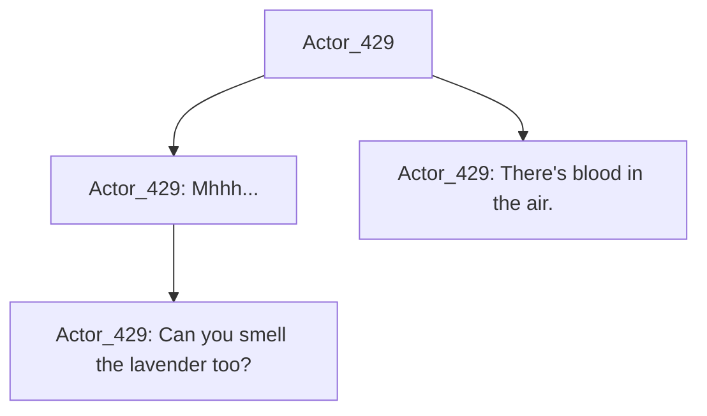

# Characters/Vanessza

```mermaid
graph TD
    427_0["Actor_429"]
    427_1["Actor_429: Mhhh..."]
    427_2["Actor_429: Can you smell the lavender too?"]
    427_3["Actor_429: There's blood in the air."]
    427_0 --> 427_1
    427_0 --> 427_3
    427_1 --> 427_2
```