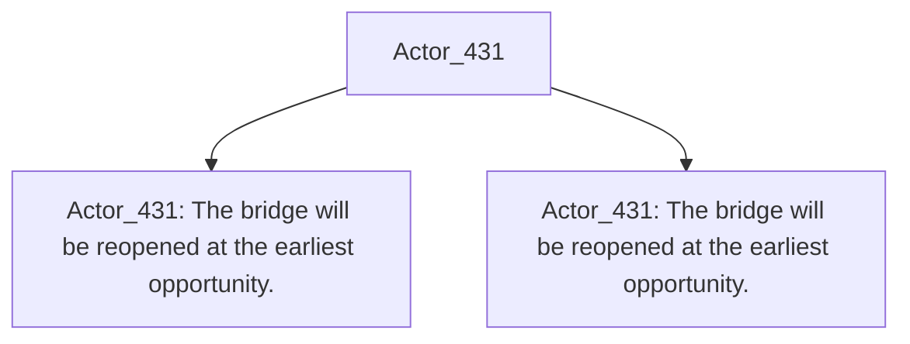

# Characters/Vasco

```mermaid
graph TD
    429_0["Actor_431"]
    429_1["Actor_431: The bridge will be reopened at the earliest opportunity."]
    429_2["Actor_431: The bridge will be reopened at the earliest opportunity."]
    429_0 --> 429_1
    429_0 --> 429_2
```