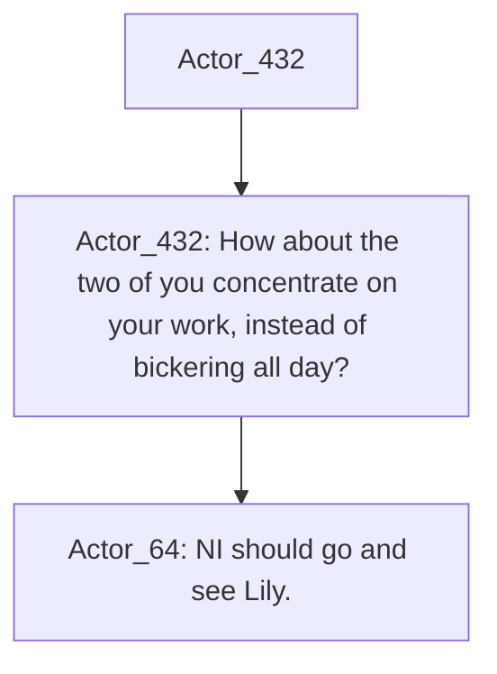

# Characters/Vasil

```mermaid
graph TD
    430_0["Actor_432"]
    430_1["Actor_432: How about the two of you concentrate on your work, instead of bickering all day?"]
    430_2["Actor_64: NI should go and see Lily."]
    430_0 --> 430_1
    430_1 --> 430_2
```