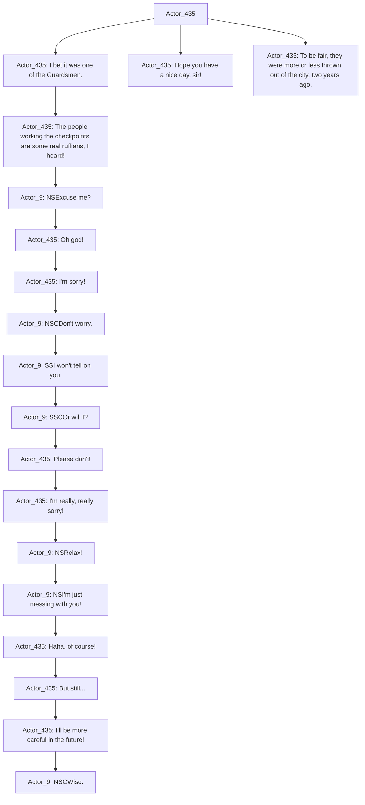

# Characters/Vera

```mermaid
graph TD
    434_0["Actor_435"]
    434_1["Actor_435: I bet it was one of the Guardsmen."]
    434_2["Actor_435: The people working the checkpoints are some real ruffians, I heard!"]
    434_3["Actor_9: NSExcuse me?"]
    434_4["Actor_435: Oh god!"]
    434_5["Actor_435: I'm sorry!"]
    434_6["Actor_9: NSCDon't worry."]
    434_7["Actor_9: SSI won't tell on you."]
    434_8["Actor_9: SSCOr will I?"]
    434_9["Actor_435: Please don't!"]
    434_10["Actor_435: I'm really, really sorry!"]
    434_11["Actor_9: NSRelax!"]
    434_12["Actor_9: NSI'm just messing with you!"]
    434_13["Actor_435: Haha, of course!"]
    434_14["Actor_435: But still..."]
    434_15["Actor_435: I'll be more careful in the future!"]
    434_16["Actor_9: NSCWise."]
    434_17["Actor_435: Hope you have a nice day, sir!"]
    434_18["Actor_435: To be fair, they were more or less thrown out of the city, two years ago."]
    434_0 --> 434_1
    434_0 --> 434_17
    434_0 --> 434_18
    434_1 --> 434_2
    434_2 --> 434_3
    434_3 --> 434_4
    434_4 --> 434_5
    434_5 --> 434_6
    434_6 --> 434_7
    434_7 --> 434_8
    434_8 --> 434_9
    434_9 --> 434_10
    434_10 --> 434_11
    434_11 --> 434_12
    434_12 --> 434_13
    434_13 --> 434_14
    434_14 --> 434_15
    434_15 --> 434_16
```