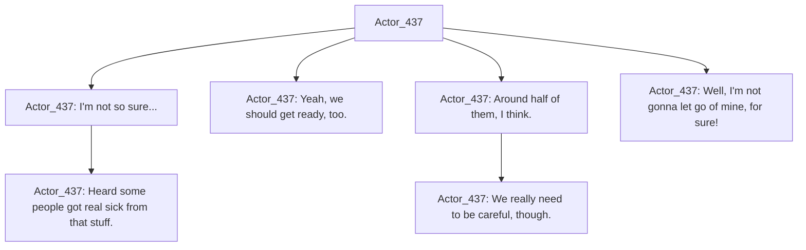

# Characters/Victor

```mermaid
graph TD
    436_0["Actor_437"]
    436_1["Actor_437: I'm not so sure..."]
    436_2["Actor_437: Heard some people got real sick from that stuff."]
    436_3["Actor_437: Yeah, we should get ready, too."]
    436_4["Actor_437: Around half of them, I think."]
    436_5["Actor_437: We really need to be careful, though."]
    436_6["Actor_437: Well, I'm not gonna let go of mine, for sure!"]
    436_0 --> 436_1
    436_0 --> 436_3
    436_0 --> 436_4
    436_0 --> 436_6
    436_1 --> 436_2
    436_4 --> 436_5
```