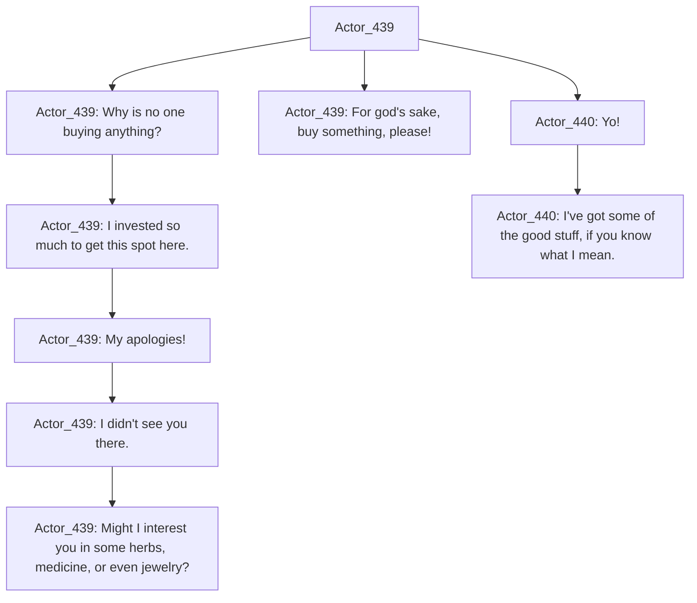

# Characters/Viljam

```mermaid
graph TD
    437_0["Actor_439"]
    437_1["Actor_439: Why is no one buying anything?"]
    437_2["Actor_439: I invested so much to get this spot here."]
    437_3["Actor_439: My apologies!"]
    437_4["Actor_439: I didn't see you there."]
    437_5["Actor_439: Might I interest you in some herbs, medicine, or even jewelry?"]
    437_6["Actor_439: For god's sake, buy something, please!"]
    437_7["Actor_440: Yo!"]
    437_8["Actor_440: I've got some of the good stuff, if you know what I mean."]
    437_0 --> 437_1
    437_0 --> 437_6
    437_0 --> 437_7
    437_1 --> 437_2
    437_2 --> 437_3
    437_3 --> 437_4
    437_4 --> 437_5
    437_7 --> 437_8
```