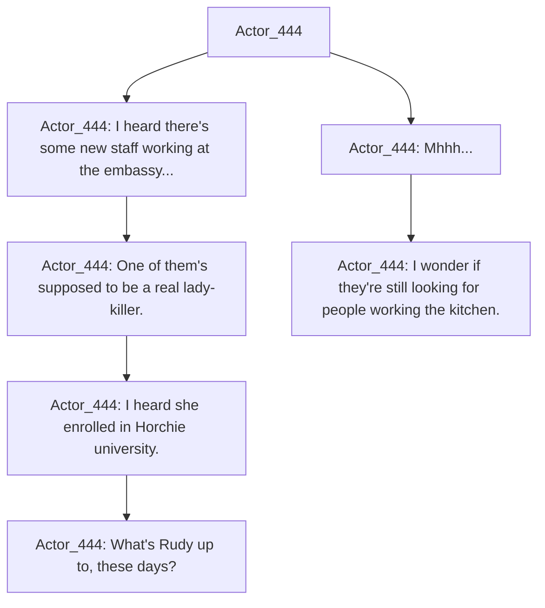

# Characters/Walburga

```mermaid
graph TD
    442_0["Actor_444"]
    442_1["Actor_444: I heard there's some new staff working at the embassy..."]
    442_2["Actor_444: One of them's supposed to be a real lady-killer."]
    442_3["Actor_444: I heard she enrolled in Horchie university."]
    442_4["Actor_444: What's Rudy up to, these days?"]
    442_5["Actor_444: Mhhh..."]
    442_6["Actor_444: I wonder if they're still looking for people working the kitchen."]
    442_0 --> 442_1
    442_0 --> 442_5
    442_1 --> 442_2
    442_2 --> 442_3
    442_3 --> 442_4
    442_5 --> 442_6
```