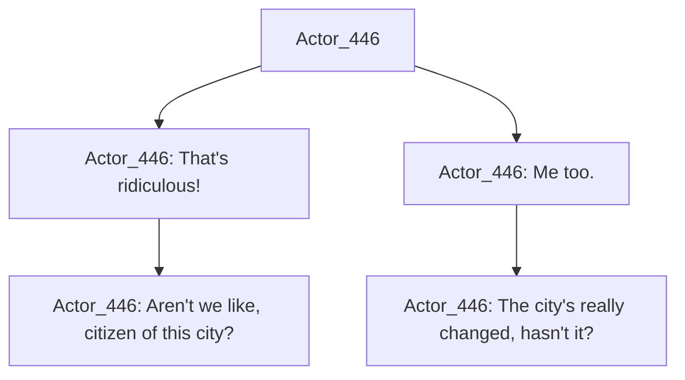

# Characters/Wil

```mermaid
graph TD
    443_0["Actor_446"]
    443_1["Actor_446: That's ridiculous!"]
    443_2["Actor_446: Aren't we like, citizen of this city?"]
    443_3["Actor_446: Me too."]
    443_4["Actor_446: The city's really changed, hasn't it?"]
    443_0 --> 443_1
    443_0 --> 443_3
    443_1 --> 443_2
    443_3 --> 443_4
```