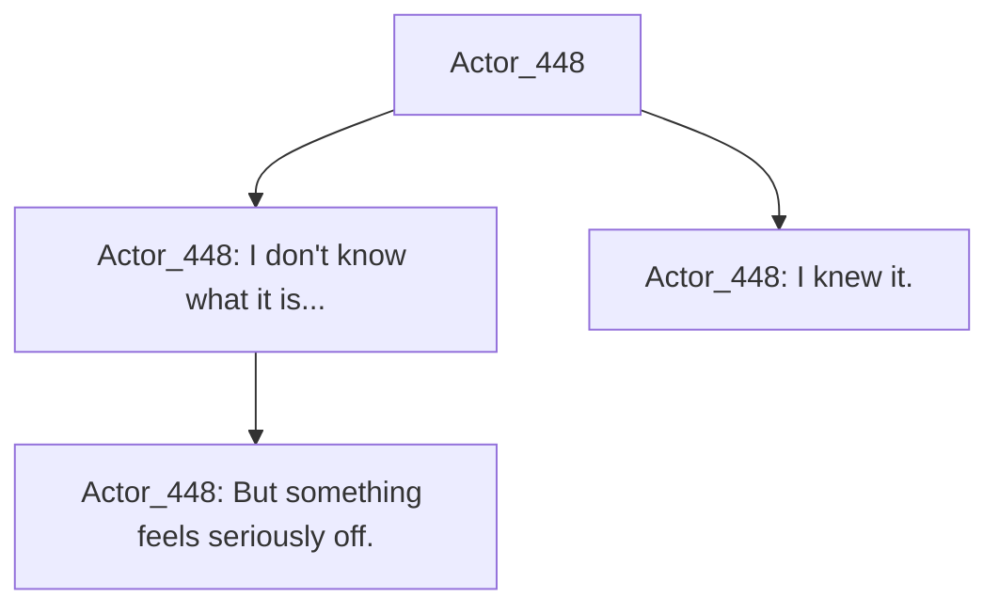

# Characters/Yannick

```mermaid
graph TD
    446_0["Actor_448"]
    446_1["Actor_448: I don't know what it is..."]
    446_2["Actor_448: But something feels seriously off."]
    446_3["Actor_448: I knew it."]
    446_0 --> 446_1
    446_0 --> 446_3
    446_1 --> 446_2
```