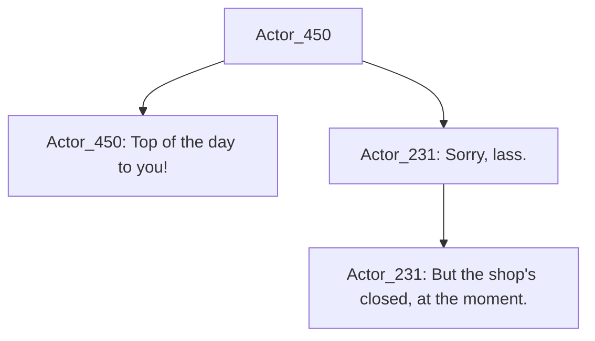

# Characters/Yvan

```mermaid
graph TD
    448_0["Actor_450"]
    448_1["Actor_450: Top of the day to you!"]
    448_2["Actor_231: Sorry, lass."]
    448_3["Actor_231: But the shop's closed, at the moment."]
    448_0 --> 448_1
    448_0 --> 448_2
    448_2 --> 448_3
```