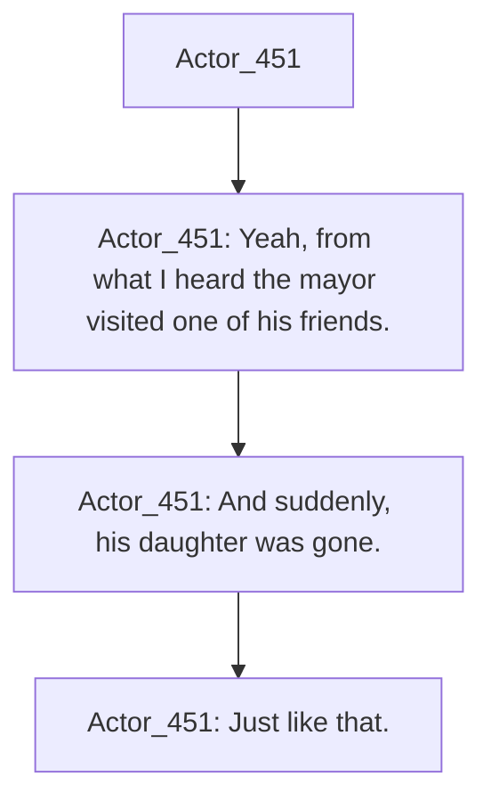

# Characters/Zan

```mermaid
graph TD
    449_0["Actor_451"]
    449_1["Actor_451: Yeah, from what I heard the mayor visited one of his friends."]
    449_2["Actor_451: And suddenly, his daughter was gone."]
    449_3["Actor_451: Just like that."]
    449_0 --> 449_1
    449_1 --> 449_2
    449_2 --> 449_3
```