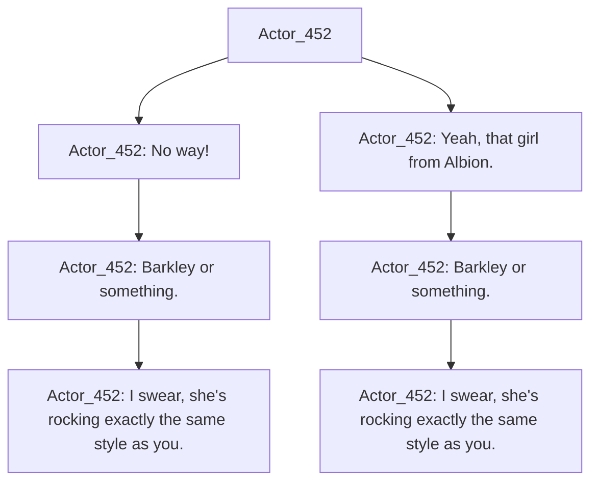

# Characters/Zaneta

```mermaid
graph TD
    450_0["Actor_452"]
    450_1["Actor_452: No way!"]
    450_2["Actor_452: Barkley or something."]
    450_3["Actor_452: I swear, she's rocking exactly the same style as you."]
    450_4["Actor_452: Yeah, that girl from Albion."]
    450_5["Actor_452: Barkley or something."]
    450_6["Actor_452: I swear, she's rocking exactly the same style as you."]
    450_0 --> 450_1
    450_0 --> 450_4
    450_1 --> 450_2
    450_2 --> 450_3
    450_4 --> 450_5
    450_5 --> 450_6
```