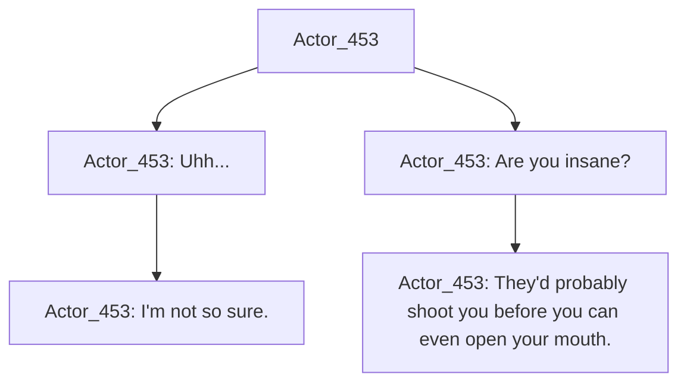

# Characters/Zara

```mermaid
graph TD
    451_0["Actor_453"]
    451_1["Actor_453: Uhh..."]
    451_2["Actor_453: I'm not so sure."]
    451_3["Actor_453: Are you insane?"]
    451_4["Actor_453: They'd probably shoot you before you can even open your mouth."]
    451_0 --> 451_1
    451_0 --> 451_3
    451_1 --> 451_2
    451_3 --> 451_4
```