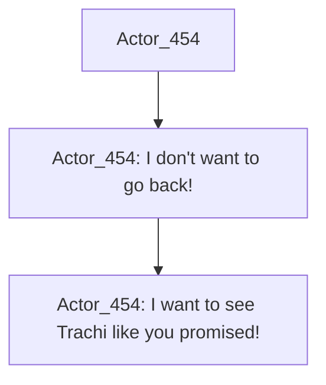

# Characters/Zente

```mermaid
graph TD
    452_0["Actor_454"]
    452_1["Actor_454: I don't want to go back!"]
    452_2["Actor_454: I want to see Trachi like you promised!"]
    452_0 --> 452_1
    452_1 --> 452_2
```