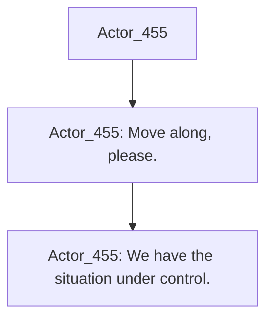

# Characters/Zeteny

```mermaid
graph TD
    453_0["Actor_455"]
    453_1["Actor_455: Move along, please."]
    453_2["Actor_455: We have the situation under control."]
    453_0 --> 453_1
    453_1 --> 453_2
```