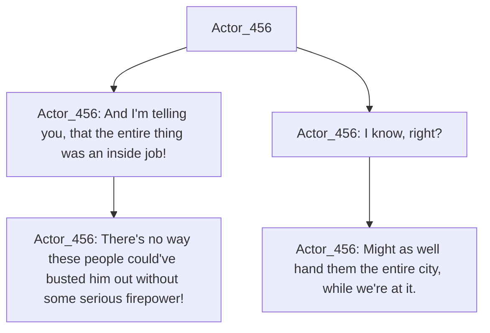

# Characters/Zinoviy

```mermaid
graph TD
    454_0["Actor_456"]
    454_1["Actor_456: And I'm telling you, that the entire thing was an inside job!"]
    454_2["Actor_456: There's no way these people could've busted him out without some serious firepower!"]
    454_3["Actor_456: I know, right?"]
    454_4["Actor_456: Might as well hand them the entire city, while we're at it."]
    454_0 --> 454_1
    454_0 --> 454_3
    454_1 --> 454_2
    454_3 --> 454_4
```