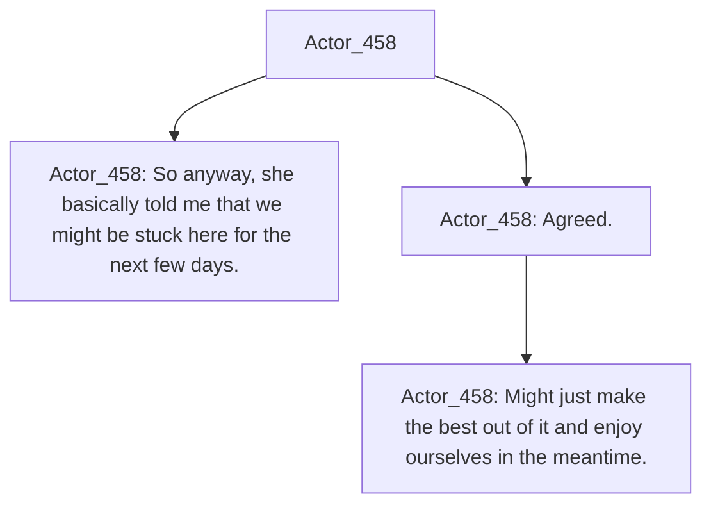

# Characters/Zoja

```mermaid
graph TD
    455_0["Actor_458"]
    455_1["Actor_458: So anyway, she basically told me that we might be stuck here for the next few days."]
    455_2["Actor_458: Agreed."]
    455_3["Actor_458: Might just make the best out of it and enjoy ourselves in the meantime."]
    455_0 --> 455_1
    455_0 --> 455_2
    455_2 --> 455_3
```