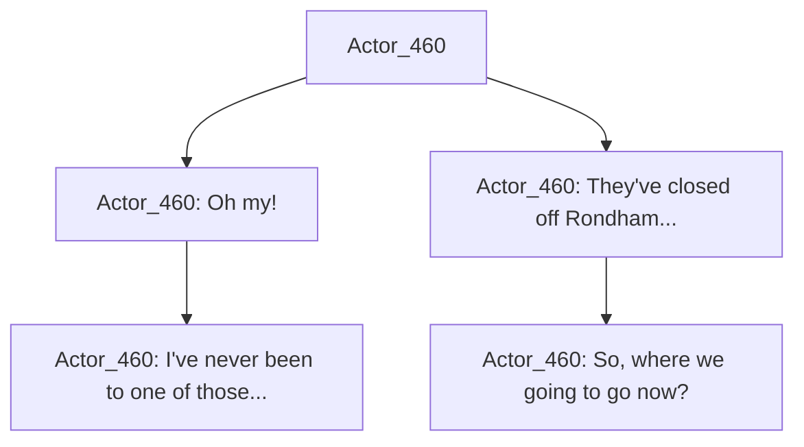

# Characters/Zuza

```mermaid
graph TD
    457_0["Actor_460"]
    457_1["Actor_460: Oh my!"]
    457_2["Actor_460: I've never been to one of those..."]
    457_3["Actor_460: They've closed off Rondham..."]
    457_4["Actor_460: So, where we going to go now?"]
    457_0 --> 457_1
    457_0 --> 457_3
    457_1 --> 457_2
    457_3 --> 457_4
```