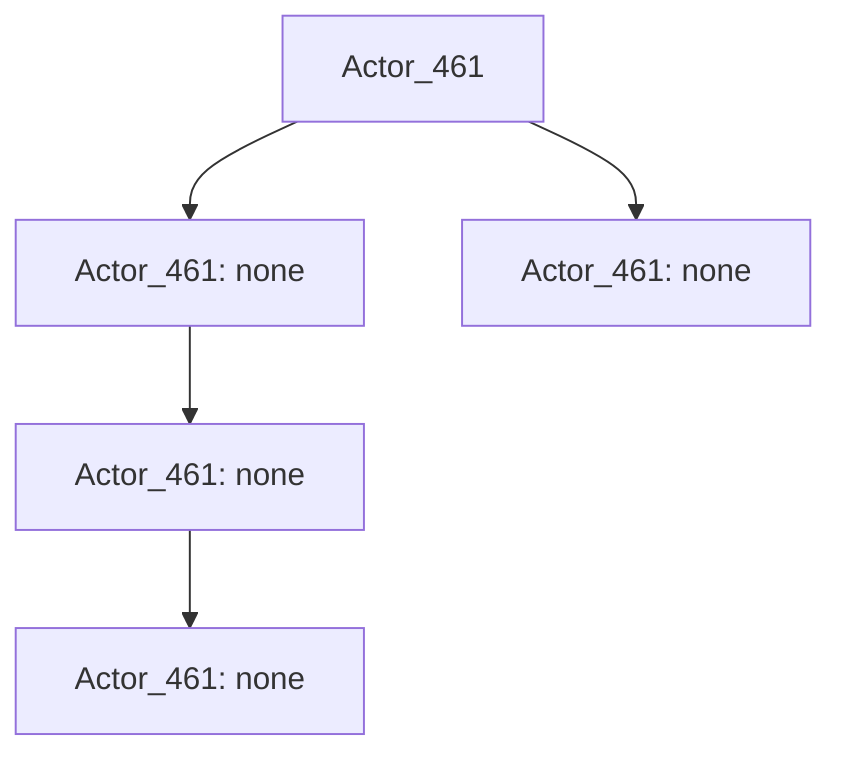

# Characters/none

```mermaid
graph TD
    458_0["Actor_461"]
    458_1["Actor_461: none"]
    458_2["Actor_461: none"]
    458_3["Actor_461: none"]
    458_4["Actor_461: none"]
    458_0 --> 458_1
    458_0 --> 458_4
    458_1 --> 458_2
    458_2 --> 458_3
```