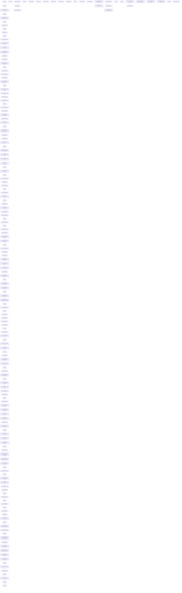

# Ionia/Aion/Atlas/Atlantis

```mermaid
graph TD
    14_0["Actor_13"]
    14_1["Actor_16"]
    14_3["Actor_16"]
    14_4["Actor_16: RÁron?"]
    14_6["Actor_13: What's wrong?"]
    14_8["Actor_16: NGDI was about to ask you."]
    14_9["Actor_13: What do you mean?"]
    14_10["Actor_16: NCYou were doing the thing again."]
    14_11["Actor_13: Was I?"]
    14_12["Actor_13: NCSorry."]
    14_13["Actor_16: NSCYou don't need to apologise."]
    14_14["Actor_16"]
    14_15["Actor_16: NCIt's just..."]
    14_16["Actor_16: A bit unsettling."]
    14_17["Actor_13: NCSorry."]
    14_18["Actor_16: NGDStop it already, you doofus!"]
    14_19["Actor_16"]
    14_20["Actor_16: NSCI'm not mad or anything."]
    14_21["Actor_16: NSJust curious."]
    14_22["Actor_13: About what?"]
    14_23["Actor_16: NSWhat it's like."]
    14_24["Actor_16"]
    14_25["Actor_16: NCI shouldn't pry."]
    14_26["Actor_16: NPCSorry."]
    14_27["Actor_13: NCYou don't need to apologise."]
    14_28["Actor_16: RCHonestly."]
    14_29["Actor_16: NGDFuck you too!"]
    14_30["Actor_16"]
    14_31["Actor_13: NCHave you ever felt as if you weren't there?"]
    14_32["Actor_16: NPCUhh..."]
    14_33["Actor_16: NPWhat?"]
    14_34["Actor_13: That's how it feels."]
    14_35["Actor_13"]
    14_36["Actor_16: RDo you want to be somewhere else?"]
    14_37["Actor_13: NCNot like it's up to me."]
    14_38["Actor_13: NPCMost of the time."]
    14_39["Actor_13: NPIt just happens."]
    14_41["Actor_16: Where does it take you?"]
    14_42["Actor_16"]
    14_43["Actor_13: Close your eyes."]
    14_44["Actor_16: What?"]
    14_45["Actor_13: NCJust do it."]
    14_46["Actor_13"]
    14_47["Actor_16: NCWhat now?"]
    14_48["Actor_13: NCAre you there?"]
    14_50["Actor_16: SCHuh?"]
    14_51["Actor_16: SWAre you losing it?"]
    14_52["Actor_13: NCEyes shut."]
    14_53["Actor_13: Mouth closed."]
    14_54["Actor_13"]
    14_55["Actor_13: Deep breaths."]
    14_56["Actor_13"]
    14_57["Actor_13: Are you there?"]
    14_58["Actor_16: NCI guess."]
    14_59["Actor_13"]
    14_60["Actor_13: Now think about a painful memory."]
    14_61["Actor_13: Are you angry with yourself?"]
    14_66["Actor_13"]
    14_67["Actor_13: NCCan you embrace that person?"]
    14_68["Actor_13: At the risk of making that mistake again?"]
    14_76["Actor_13"]
    14_77["Actor_13: Open your eyes."]
    14_78["Actor_13"]
    14_79["Actor_16: SCWait."]
    14_80["Actor_16: SThat's it?"]
    14_81["Actor_13: That's what?"]
    14_82["Actor_16: The thing!"]
    14_87["Actor_13"]
    14_89["Actor_13: NCPart of it."]
    14_90["Actor_16: What about the rest?"]
    14_91["Actor_16"]
    14_92["Actor_13: That's me saying no."]
    14_93["Actor_13: NCOver and over again."]
    14_94["Actor_13"]
    14_95["Actor_16: RWhy?"]
    14_96["Actor_13: NCBecause I’d rather hate myself."]
    14_97["Actor_13"]
    14_98["Actor_16: NPCÁron."]
    14_100["Actor_16: NPHow long has this been going on?"]
    14_101["Actor_16"]
    14_102["Actor_13: You remember when we met?"]
    14_104["Actor_16: NCLike I could forget."]
    14_105["Actor_13: NCSince then."]
    14_106["Actor_13: And longer."]
    14_107["Actor_13"]
    14_108["Actor_16: RCI'm sorry."]
    14_109["Actor_13: NPCI didn’t mean it that way."]
    14_110["Actor_13: NPIt’s not like you’re the cause."]
    14_111["Actor_16: SCDoesn't matter."]
    14_113["Actor_16: SI want to fix it either way!"]
    14_114["Actor_13: NCI know."]
    14_120["Actor_13: I'm glad you understand."]
    14_122["Actor_16: NSCI love you too."]
    14_123["Actor_16: NCYeah."]
    14_124["Actor_13"]
    14_125["Actor_16: RPCYou love me because I want to put things right."]
    14_126["Actor_13: NCIf that's how you want to put it."]
    14_129["Actor_16: RPAnd I love you because you won't let me."]
    14_130["Actor_13"]
    14_131["Actor_16: What about you?"]
    14_132["Actor_16"]
    14_133["Actor_13: Shouldn't you be heading out?"]
    14_134["Actor_16: NWWhat time's it even?"]
    14_135["Actor_13: Half-past five."]
    14_136["Actor_16: NEFuck!"]
    14_137["Actor_16"]
    14_138["Actor_13: Service card?"]
    14_139["Actor_16: NSRight here!"]
    14_140["Actor_16"]
    14_141["Actor_16: NSCÁron?"]
    14_142["Actor_13: Hm?"]
    14_143["Actor_16: RSI'm glad we talked."]
    14_144["Actor_16"]
    14_145["Actor_13: NCAs long as we don't make it a habit."]
    14_146["Actor_16: NGDDon't worry!"]
    14_147["Actor_16: NSCI might be off for a couple of weeks anyway."]
    14_149["Actor_13: Where to?"]
    14_151["Actor_16: NSIt's just rumours at this point."]
    14_152["Actor_16: NSCSomething about a city and a dam."]
    14_153["Actor_16: NGDI'll tell you about it tonight!"]
    14_154["Actor_16: NSIf you want to talk some more."]
    14_155["Actor_16"]
    14_156["Actor_13: NCI'll think about it."]
    14_157["Actor_16: NSCGood."]
    14_158["Actor_16: NSI'll see you later!"]
    14_159["Actor_16"]
    14_160["Actor_16"]
    14_161["Actor_16: Áron?"]
    14_162["Actor_16: Hm."]
    14_163["Actor_16: RHey."]
    14_164["Actor_16: RHey."]
    14_165["Actor_16: RHey."]
    14_166["Actor_16: RHey."]
    14_167["Actor_16: NSCYou'll hate me for this."]
    14_168["Actor_16"]
    14_169["Actor_16: RHey."]
    14_170["Actor_16: NGDHave you seen my service card?"]
    14_171["Actor_16"]
    14_172["Actor_16: RÁron?"]
    14_173["Actor_16: SHey."]
    14_174["Actor_16"]
    14_176["Actor_16"]
    14_178["Actor_13: Than anybody else."]
    14_179["Actor_13"]
    14_180["Actor_16"]
    14_181["Actor_13"]
    14_182["Actor_13"]
    14_184["Actor_16"]
    14_186["Actor_16: NCI lost something important."]
    14_187["Actor_13: NCThe worse the better."]
    14_188["Actor_16: That's it?"]
    14_189["Actor_13: Yeah."]
    14_191["Actor_16: NCNot really."]
    14_192["Actor_13"]
    14_193["Actor_13: How does it feel?"]
    14_194["Actor_16: NCStings."]
    14_195["Actor_13"]
    14_198["Actor_13: Why?"]
    14_199["Actor_16: NCI did something stupid."]
    14_201["Actor_13"]
    14_202["Actor_13: Can you get it back?"]
    14_203["Actor_13: Would you?"]
    14_204["Actor_13: Would you do the stupid thing again?"]
    14_205["Actor_16: NCFor sure."]
    14_206["Actor_13: Even it if erased your former self?"]
    14_207["Actor_16: NCI guess I'm angry at myself."]
    14_208["Actor_16: NCMhm."]
    14_209["Actor_13: NCImagine a version of yourself."]
    14_210["Actor_13"]
    14_211["Actor_13: Would you do it again?"]
    14_212["Actor_16: SCAbsolutely not."]
    14_213["Actor_13: The one that made a mistake."]
    14_214["Actor_13"]
    14_215["Actor_13: Why not?"]
    14_216["Actor_16: NCBecause I know better now."]
    14_218["Actor_16"]
    14_219["Actor_16: NSJust the way you are."]
    14_220["Actor_13: That's why I'm in love with you."]
    14_221["Actor_16: NCIs that why I love you, too?"]
    14_222["Actor_16"]
    14_223["Actor_13: NCI know."]
    14_0 --> 14_1
    14_1 --> 14_167
    14_3 --> 14_4
    14_4 --> 14_171
    14_6 --> 14_8
    14_8 --> 14_9
    14_9 --> 14_10
    14_10 --> 14_11
    14_11 --> 14_12
    14_12 --> 14_13
    14_13 --> 14_14
    14_14 --> 14_15
    14_15 --> 14_16
    14_16 --> 14_17
    14_17 --> 14_18
    14_18 --> 14_19
    14_19 --> 14_20
    14_20 --> 14_21
    14_21 --> 14_22
    14_22 --> 14_23
    14_23 --> 14_24
    14_24 --> 14_25
    14_25 --> 14_26
    14_26 --> 14_27
    14_27 --> 14_28
    14_28 --> 14_29
    14_29 --> 14_30
    14_30 --> 14_31
    14_31 --> 14_32
    14_32 --> 14_33
    14_33 --> 14_34
    14_34 --> 14_35
    14_35 --> 14_36
    14_36 --> 14_37
    14_37 --> 14_38
    14_38 --> 14_39
    14_39 --> 14_179
    14_41 --> 14_42
    14_42 --> 14_43
    14_43 --> 14_44
    14_44 --> 14_45
    14_45 --> 14_46
    14_46 --> 14_47
    14_47 --> 14_48
    14_48 --> 14_184
    14_50 --> 14_51
    14_51 --> 14_52
    14_52 --> 14_53
    14_53 --> 14_54
    14_54 --> 14_55
    14_55 --> 14_56
    14_56 --> 14_57
    14_57 --> 14_58
    14_58 --> 14_60
    14_60 --> 14_187
    14_61 --> 14_208
    14_67 --> 14_68
    14_68 --> 14_76
    14_76 --> 14_77
    14_77 --> 14_78
    14_78 --> 14_79
    14_79 --> 14_80
    14_80 --> 14_81
    14_81 --> 14_82
    14_82 --> 14_87
    14_87 --> 14_89
    14_89 --> 14_90
    14_90 --> 14_91
    14_91 --> 14_92
    14_92 --> 14_93
    14_93 --> 14_94
    14_94 --> 14_95
    14_95 --> 14_96
    14_96 --> 14_178
    14_97 --> 14_98
    14_98 --> 14_100
    14_100 --> 14_101
    14_101 --> 14_102
    14_102 --> 14_104
    14_104 --> 14_105
    14_105 --> 14_106
    14_106 --> 14_107
    14_107 --> 14_108
    14_108 --> 14_109
    14_109 --> 14_110
    14_110 --> 14_111
    14_111 --> 14_113
    14_113 --> 14_114
    14_114 --> 14_220
    14_120 --> 14_124
    14_122 --> 14_219
    14_123 --> 14_125
    14_124 --> 14_123
    14_125 --> 14_129
    14_126 --> 14_130
    14_129 --> 14_126
    14_130 --> 14_131
    14_131 --> 14_132
    14_132 --> 14_133
    14_133 --> 14_134
    14_134 --> 14_135
    14_135 --> 14_136
    14_136 --> 14_137
    14_137 --> 14_138
    14_138 --> 14_181
    14_139 --> 14_140
    14_140 --> 14_141
    14_141 --> 14_142
    14_142 --> 14_143
    14_143 --> 14_144
    14_144 --> 14_145
    14_145 --> 14_146
    14_146 --> 14_180
    14_147 --> 14_149
    14_149 --> 14_151
    14_151 --> 14_152
    14_152 --> 14_153
    14_153 --> 14_154
    14_154 --> 14_155
    14_155 --> 14_156
    14_156 --> 14_157
    14_157 --> 14_160
    14_158 --> 14_159
    14_159 --> 14_182
    14_160 --> 14_158
    14_167 --> 14_176
    14_170 --> 14_3
    14_171 --> 14_173
    14_173 --> 14_174
    14_174 --> 14_6
    14_176 --> 14_170
    14_178 --> 14_97
    14_179 --> 14_41
    14_180 --> 14_147
    14_181 --> 14_139
    14_184 --> 14_50
    14_186 --> 14_202
    14_187 --> 14_192
    14_188 --> 14_189
    14_189 --> 14_191
    14_192 --> 14_193
    14_193 --> 14_194
    14_194 --> 14_198
    14_198 --> 14_199
    14_199 --> 14_211
    14_203 --> 14_205
    14_205 --> 14_206
    14_209 --> 14_213
    14_210 --> 14_209
    14_211 --> 14_212
    14_212 --> 14_215
    14_213 --> 14_214
    14_214 --> 14_67
    14_215 --> 14_216
    14_216 --> 14_210
    14_218 --> 14_122
    14_219 --> 14_120
    14_220 --> 14_218
```