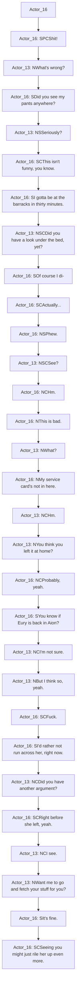

# Ionia/Aion/Atlas Home/EV001

```mermaid
graph TD
    465_0["Actor_16"]
    465_1["Actor_16: SPCShit!"]
    465_2["Actor_13: NWhat's wrong?"]
    465_3["Actor_16: SDid you see my pants anywhere?"]
    465_4["Actor_13: NSSeriously?"]
    465_5["Actor_16: SCThis isn't funny, you know."]
    465_6["Actor_16: SI gotta be at the barracks in thirty minutes."]
    465_7["Actor_13: NSCDid you have a look under the bed, yet?"]
    465_8["Actor_16: SOf course I di-"]
    465_9["Actor_16: SCActually..."]
    465_10["Actor_16: NSPhew."]
    465_11["Actor_13: NSCSee?"]
    465_12["Actor_16: NCHm."]
    465_13["Actor_16: NThis is bad."]
    465_14["Actor_13: NWhat?"]
    465_15["Actor_16: NMy service card's not in here."]
    465_16["Actor_13: NCHm."]
    465_17["Actor_13: NYou think you left it at home?"]
    465_18["Actor_16: NCProbably, yeah."]
    465_19["Actor_16: SYou know if Eury is back in Aion?"]
    465_20["Actor_13: NCI'm not sure."]
    465_21["Actor_13: NBut I think so, yeah."]
    465_22["Actor_16: SCFuck."]
    465_23["Actor_16: SI'd rather not run across her, right now."]
    465_24["Actor_13: NCDid you have another argument?"]
    465_25["Actor_16: SCRight before she left, yeah."]
    465_26["Actor_13: NCI see."]
    465_27["Actor_13: NWant me to go and fetch your stuff for you?"]
    465_28["Actor_16: SIt's fine."]
    465_29["Actor_16: SCSeeing you might just rile her up even more."]
    465_0 --> 465_1
    465_1 --> 465_2
    465_2 --> 465_3
    465_3 --> 465_4
    465_4 --> 465_5
    465_5 --> 465_6
    465_6 --> 465_7
    465_7 --> 465_8
    465_8 --> 465_9
    465_9 --> 465_10
    465_10 --> 465_11
    465_11 --> 465_12
    465_12 --> 465_13
    465_13 --> 465_14
    465_14 --> 465_15
    465_15 --> 465_16
    465_16 --> 465_17
    465_17 --> 465_18
    465_18 --> 465_19
    465_19 --> 465_20
    465_20 --> 465_21
    465_21 --> 465_22
    465_22 --> 465_23
    465_23 --> 465_24
    465_24 --> 465_25
    465_25 --> 465_26
    465_26 --> 465_27
    465_27 --> 465_28
    465_28 --> 465_29
```