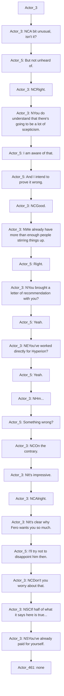

# Ionia/Aion/CoExA/EV006

```mermaid
graph TD
    466_0["Actor_3"]
    466_1["Actor_3: NCA bit unusual, isn't it?"]
    466_2["Actor_5: But not unheard of."]
    466_3["Actor_3: NCRight."]
    466_4["Actor_3: NYou do understand that there's going to be a lot of scepticism."]
    466_5["Actor_5: I am aware of that."]
    466_6["Actor_5: And I intend to prove it wrong."]
    466_7["Actor_3: NCGood."]
    466_8["Actor_3: NWe already have more than enough people stirring things up."]
    466_9["Actor_5: Right."]
    466_10["Actor_3: NYou brought a letter of recommendation with you?"]
    466_11["Actor_5: Yeah."]
    466_12["Actor_3: NEYou've worked directly for Hyperion?"]
    466_13["Actor_5: Yeah."]
    466_14["Actor_3: NHm..."]
    466_15["Actor_5: Something wrong?"]
    466_16["Actor_3: NCOn the contrary."]
    466_17["Actor_3: NIt's impressive."]
    466_18["Actor_3: NCAlright."]
    466_19["Actor_3: NIt's clear why Fero wants you so much."]
    466_20["Actor_5: I'll try not to disappoint him then."]
    466_21["Actor_3: NCDon't you worry about that."]
    466_22["Actor_3: NSCIf half of what it says here is true..."]
    466_23["Actor_3: NSYou've already paid for yourself."]
    466_24["Actor_461: none"]
    466_0 --> 466_1
    466_1 --> 466_2
    466_2 --> 466_3
    466_3 --> 466_4
    466_4 --> 466_5
    466_5 --> 466_6
    466_6 --> 466_7
    466_7 --> 466_8
    466_8 --> 466_9
    466_9 --> 466_10
    466_10 --> 466_11
    466_11 --> 466_12
    466_12 --> 466_13
    466_13 --> 466_14
    466_14 --> 466_15
    466_15 --> 466_16
    466_16 --> 466_17
    466_17 --> 466_18
    466_18 --> 466_19
    466_19 --> 466_20
    466_20 --> 466_21
    466_21 --> 466_22
    466_22 --> 466_23
    466_23 --> 466_24
```