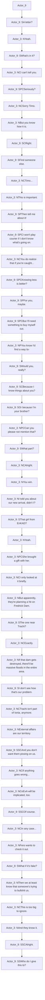

# Ionia/Aion/CoExA/Lorentz Office/EV006

```mermaid
graph TD
    467_0["Actor_9"]
    467_1["Actor_9: SA letter?"]
    467_2["Actor_3: NYeah."]
    467_3["Actor_9: SWhat's in it?"]
    467_4["Actor_3: NCI can't tell you."]
    467_5["Actor_9: SPCSeriously?"]
    467_6["Actor_3: NCSorry Timo."]
    467_7["Actor_3: NBut you know how it is."]
    467_8["Actor_9: SCRight."]
    467_9["Actor_9: SFind someone else."]
    467_10["Actor_3: NCTimo..."]
    467_11["Actor_3: NThis is important."]
    467_12["Actor_9: SPThen tell me about it!"]
    467_13["Actor_9: SPCI won't play courier if I don't know what's going on."]
    467_14["Actor_3: NCYou do realize that if you're caught..."]
    467_15["Actor_9: SPCKnowing less is better?"]
    467_16["Actor_9: SPFor you, maybe."]
    467_17["Actor_9: SPCBut I'll need something to buy myself out."]
    467_18["Actor_3: NPYou know I'd find a way to-"]
    467_19["Actor_9: SWould you, really?"]
    467_20["Actor_9: SCBecause I know things about you?"]
    467_21["Actor_9: SOr because I'm your brother?"]
    467_22["Actor_3: NPCCan you please not mention that?"]
    467_23["Actor_9: SWhat part?"]
    467_24["Actor_3: NCAlright."]
    467_25["Actor_3: NYou win."]
    467_26["Actor_3: NI told you about our new arrival, didn't I?"]
    467_27["Actor_9: SThat girl from EnKAD?"]
    467_28["Actor_3: NYeah."]
    467_29["Actor_3: NPCShe brought a gift with her."]
    467_30["Actor_3: NCI only looked at it briefly."]
    467_31["Actor_3: NBut apparently, they're planning a hit on Fredrick Dam."]
    467_32["Actor_9: SThe one near Trachi?"]
    467_33["Actor_3: NCExactly."]
    467_34["Actor_3: NIf that dam gets destroyed, there'll be massive floods in the entire area."]
    467_35["Actor_9: SI don't see how that's our problem."]
    467_36["Actor_3: NCTrachi isn't part of Ionia, anymore."]
    467_37["Actor_3: NExternal affairs are our territory."]
    467_38["Actor_9: SSCAnd you don't want them pissing on us."]
    467_39["Actor_3: NCIf anything goes wrong..."]
    467_40["Actor_3: NCoExA will be implicated, too."]
    467_41["Actor_9: SSCOf course."]
    467_42["Actor_3: NCIn any case..."]
    467_43["Actor_3: NFero wants to check it out."]
    467_44["Actor_9: SWhat if it's fake?"]
    467_45["Actor_3: NThen we at least know that someone's trying to bullshit us."]
    467_46["Actor_3: NCThis is too big to ignore."]
    467_47["Actor_3: NAnd they know it."]
    467_48["Actor_9: SSCAlright."]
    467_49["Actor_9: SSWho do I give this to?"]
    467_0 --> 467_1
    467_1 --> 467_2
    467_2 --> 467_3
    467_3 --> 467_4
    467_4 --> 467_5
    467_5 --> 467_6
    467_6 --> 467_7
    467_7 --> 467_8
    467_8 --> 467_9
    467_9 --> 467_10
    467_10 --> 467_11
    467_11 --> 467_12
    467_12 --> 467_13
    467_13 --> 467_14
    467_14 --> 467_15
    467_15 --> 467_16
    467_16 --> 467_17
    467_17 --> 467_18
    467_18 --> 467_19
    467_19 --> 467_20
    467_20 --> 467_21
    467_21 --> 467_22
    467_22 --> 467_23
    467_23 --> 467_24
    467_24 --> 467_25
    467_25 --> 467_26
    467_26 --> 467_27
    467_27 --> 467_28
    467_28 --> 467_29
    467_29 --> 467_30
    467_30 --> 467_31
    467_31 --> 467_32
    467_32 --> 467_33
    467_33 --> 467_34
    467_34 --> 467_35
    467_35 --> 467_36
    467_36 --> 467_37
    467_37 --> 467_38
    467_38 --> 467_39
    467_39 --> 467_40
    467_40 --> 467_41
    467_41 --> 467_42
    467_42 --> 467_43
    467_43 --> 467_44
    467_44 --> 467_45
    467_45 --> 467_46
    467_46 --> 467_47
    467_47 --> 467_48
    467_48 --> 467_49
```