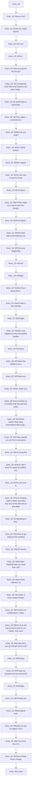

# Ionia/Aion/Committee Room/EV001

```mermaid
graph TD
    468_0["Actor_19"]
    468_1["Actor_19: NHow is he?"]
    468_2["Actor_10: NCAs you might expect."]
    468_3["Actor_19: NCI see."]
    468_4["Actor_10: NCSo..."]
    468_5["Actor_10: NAre you gonna let him go?"]
    468_6["Actor_19: NCConsidering both Atlas and Orpheus are still at large..."]
    468_7["Actor_19: NI doubt that's a good idea."]
    468_8["Actor_19: NCThen again, I promised you."]
    468_9["Actor_19: NWhat do you think?"]
    468_10["Actor_10: NHe's utterly broken."]
    468_11["Actor_10: NCBut I agree."]
    468_12["Actor_10: NCIt's too risky to set him loose."]
    468_13["Actor_19: NCA shame."]
    468_14["Actor_10: NSCThere might be a way to use him, though."]
    468_15["Actor_10: NCAnd maybe..."]
    468_16["Actor_10: NFlush both Atlas and Orpheus out."]
    468_17["Actor_19: SPCAre you suggesting-"]
    468_18["Actor_10: NSI am."]
    468_19["Actor_19: NAlright."]
    468_20["Actor_19: NCBut if he's going there..."]
    468_21["Actor_19: NHe'll need a new identity."]
    468_22["Actor_10: NSCRight."]
    468_23["Actor_10: NSAnd I just happen to know the perfect handle."]
    468_24["Actor_19: NCGood."]
    468_25["Actor_19: NI'll leave the details to you."]
    468_26["Actor_10: NSThank you."]
    468_27["Actor_19: NCNo, thank you."]
    468_28["Actor_19: NYou've been an incredible help the past few years."]
    468_29["Actor_19: NCIf there weren't that many reservations about age..."]
    468_30["Actor_19: NI'd have named you as Fero's successor."]
    468_31["Actor_10: NSI'm honoured."]
    468_32["Actor_10: NCBut I don't think I'm ready for politics, yet."]
    468_33["Actor_19: NCNo one ever is."]
    468_34["Actor_19: NYou'd certainly make a better secretary than any of the half-wits at this table."]
    468_35["Actor_19: NCSpeaking of that..."]
    468_36["Actor_19: NI'll have to get ready for the meeting."]
    468_37["Actor_10: NSCOf course."]
    468_38["Actor_10: NSIs there anything else you need from me?"]
    468_39["Actor_19: NNot at the moment, no."]
    468_40["Actor_19: NIt's been a busy couple of days."]
    468_41["Actor_19: NCIf there's no complications, today..."]
    468_42["Actor_19: NBoth of us will have a lot of work on our hands, very soon."]
    468_43["Actor_19: NSo why don't you go and get some rest?"]
    468_44["Actor_10: NSCOkay."]
    468_45["Actor_19: NI'll have my assistant call you tomorrow."]
    468_46["Actor_10: NSAlright."]
    468_47["Actor_10: NSCThank you."]
    468_48["Actor_10: NSAnd good luck."]
    468_49["Actor_19: NAlways an eye for details, huh?"]
    468_50["Actor_10: NSCYou know how it is."]
    468_51["Actor_10: NSSome things never change."]
    468_52["Actor_461: none"]
    468_0 --> 468_1
    468_1 --> 468_2
    468_2 --> 468_3
    468_3 --> 468_4
    468_4 --> 468_5
    468_5 --> 468_6
    468_6 --> 468_7
    468_7 --> 468_8
    468_8 --> 468_9
    468_9 --> 468_10
    468_10 --> 468_11
    468_11 --> 468_12
    468_12 --> 468_13
    468_13 --> 468_14
    468_14 --> 468_15
    468_15 --> 468_16
    468_16 --> 468_17
    468_17 --> 468_18
    468_18 --> 468_19
    468_19 --> 468_20
    468_20 --> 468_21
    468_21 --> 468_22
    468_22 --> 468_23
    468_23 --> 468_24
    468_24 --> 468_25
    468_25 --> 468_26
    468_26 --> 468_27
    468_27 --> 468_28
    468_28 --> 468_29
    468_29 --> 468_30
    468_30 --> 468_31
    468_31 --> 468_32
    468_32 --> 468_33
    468_33 --> 468_34
    468_34 --> 468_35
    468_35 --> 468_36
    468_36 --> 468_37
    468_37 --> 468_38
    468_38 --> 468_39
    468_39 --> 468_40
    468_40 --> 468_41
    468_41 --> 468_42
    468_42 --> 468_43
    468_43 --> 468_44
    468_44 --> 468_45
    468_45 --> 468_46
    468_46 --> 468_47
    468_47 --> 468_48
    468_48 --> 468_49
    468_49 --> 468_50
    468_50 --> 468_51
    468_51 --> 468_52
```