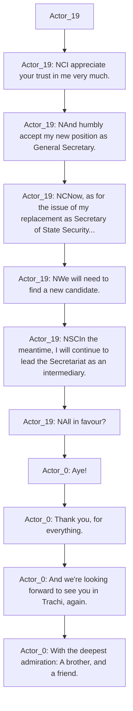

# Ionia/Aion/Committee Room/EV007

```mermaid
graph TD
    469_0["Actor_19"]
    469_1["Actor_19: NCI appreciate your trust in me very much."]
    469_2["Actor_19: NAnd humbly accept my new position as General Secretary."]
    469_3["Actor_19: NCNow, as for the issue of my replacement as Secretary of State Security..."]
    469_4["Actor_19: NWe will need to find a new candidate."]
    469_5["Actor_19: NSCIn the meantime, I will continue to lead the Secretariat as an intermediary."]
    469_6["Actor_19: NAll in favour?"]
    469_7["Actor_0: Aye!"]
    469_8["Actor_0: Thank you, for everything."]
    469_9["Actor_0: And we're looking forward to see you in Trachi, again."]
    469_10["Actor_0: With the deepest admiration: A brother, and a friend."]
    469_0 --> 469_1
    469_1 --> 469_2
    469_2 --> 469_3
    469_3 --> 469_4
    469_4 --> 469_5
    469_5 --> 469_6
    469_6 --> 469_7
    469_7 --> 469_8
    469_8 --> 469_9
    469_9 --> 469_10
```