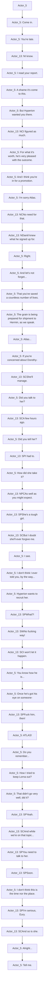

# Ionia/Aion/Debriefing Eury/EV006

```mermaid
graph TD
    470_0["Actor_5"]
    470_1["Actor_5: Come in."]
    470_2["Actor_5: You're late."]
    470_3["Actor_13: NI know."]
    470_4["Actor_5: I read your report."]
    470_5["Actor_5: A shame it's come to this."]
    470_6["Actor_5: But Hyperion wanted you there."]
    470_7["Actor_13: NCI figured as much."]
    470_8["Actor_5: For what it's worth, he's very pleased with the outcome."]
    470_9["Actor_5: And I think you're in for a promotion."]
    470_10["Actor_5: I'm sorry Atlas."]
    470_11["Actor_13: NCNo need for that."]
    470_12["Actor_13: NDaniil knew what he signed up for."]
    470_13["Actor_5: Right."]
    470_14["Actor_5: And let's not forget..."]
    470_15["Actor_5: That you've saved a countless number of lives."]
    470_16["Actor_5: The grain is being prepared for shipment to Hermin, as we speak."]
    470_17["Actor_5: Atlas..."]
    470_18["Actor_5: If you're concerned about Dorothy-"]
    470_19["Actor_13: SCShe'll manage."]
    470_20["Actor_5: Did you talk to her?"]
    470_21["Actor_13: SCA few hours ago."]
    470_22["Actor_5: Did you tell her?"]
    470_23["Actor_13: SPI had to."]
    470_24["Actor_5: How did she take it?"]
    470_25["Actor_13: NPCAs well as you might expect."]
    470_26["Actor_13: SPShe's a tough girl."]
    470_27["Actor_13: SCBut I doubt she'll ever forgive me."]
    470_28["Actor_5: I see."]
    470_29["Actor_5: I don't think I ever told you, by the way..."]
    470_30["Actor_5: Hyperion wants to recruit her."]
    470_31["Actor_13: SPWhat?!"]
    470_32["Actor_13: SWNo fucking way!"]
    470_33["Actor_13: SCI won't let it happen."]
    470_34["Actor_5: You know how he is..."]
    470_35["Actor_5: Once he's got his eye on someone-"]
    470_36["Actor_13: SPFuck him, then!"]
    470_37["Actor_5: ATLAS!"]
    470_38["Actor_5: Do you remember..."]
    470_39["Actor_5: How I tried to keep Lorna out?"]
    470_40["Actor_5: That didn't go very well, did it?"]
    470_41["Actor_13: SPYeah."]
    470_42["Actor_13: SCAnd while we're on that topic..."]
    470_43["Actor_13: SPYou need to talk to her."]
    470_44["Actor_13: SPSoon."]
    470_45["Actor_5: I don't think this is the time nor the place."]
    470_46["Actor_13: SPI'm serious, Eury."]
    470_47["Actor_13: SCAnd so is she."]
    470_48["Actor_5: Alright..."]
    470_49["Actor_5: Tell me."]
    470_0 --> 470_1
    470_1 --> 470_2
    470_2 --> 470_3
    470_3 --> 470_4
    470_4 --> 470_5
    470_5 --> 470_6
    470_6 --> 470_7
    470_7 --> 470_8
    470_8 --> 470_9
    470_9 --> 470_10
    470_10 --> 470_11
    470_11 --> 470_12
    470_12 --> 470_13
    470_13 --> 470_14
    470_14 --> 470_15
    470_15 --> 470_16
    470_16 --> 470_17
    470_17 --> 470_18
    470_18 --> 470_19
    470_19 --> 470_20
    470_20 --> 470_21
    470_21 --> 470_22
    470_22 --> 470_23
    470_23 --> 470_24
    470_24 --> 470_25
    470_25 --> 470_26
    470_26 --> 470_27
    470_27 --> 470_28
    470_28 --> 470_29
    470_29 --> 470_30
    470_30 --> 470_31
    470_31 --> 470_32
    470_32 --> 470_33
    470_33 --> 470_34
    470_34 --> 470_35
    470_35 --> 470_36
    470_36 --> 470_37
    470_37 --> 470_38
    470_38 --> 470_39
    470_39 --> 470_40
    470_40 --> 470_41
    470_41 --> 470_42
    470_42 --> 470_43
    470_43 --> 470_44
    470_44 --> 470_45
    470_45 --> 470_46
    470_46 --> 470_47
    470_47 --> 470_48
    470_48 --> 470_49
```