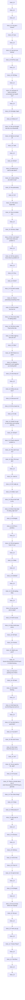

# Ionia/Aion/EnKAD 2/Atlas

```mermaid
graph TD
    7_0["Actor_14"]
    7_1["Actor_14"]
    7_2["Actor_14: You got a minute?"]
    7_3["Actor_13: Sure."]
    7_518["Actor_13"]
    7_519["Actor_14: How are you feeling?"]
    7_520["Actor_13: NCThe usual."]
    7_521["Actor_13"]
    7_522["Actor_14: NCOkay."]
    7_523["Actor_14"]
    7_524["Actor_14: SCGuess I'll have to hold this conversation by myself, hm?"]
    7_525["Actor_14"]
    7_526["Actor_13: NCAlright, Daph."]
    7_527["Actor_13: What is it?"]
    7_528["Actor_14: NCI just thought the two of us should talk..."]
    7_529["Actor_14: Before we head off."]
    7_530["Actor_13: Yeah."]
    7_531["Actor_13"]
    7_532["Actor_13: NCSo?"]
    7_533["Actor_13: What do you want to talk about?"]
    7_534["Actor_14: Is there nothing you want to say?"]
    7_535["Actor_13: Not particularly."]
    7_536["Actor_14: SC "]
    7_537["Actor_14: SThis was a stupid idea."]
    7_539["Actor_14: Sorry to bother you."]
    7_540["Actor_14"]
    7_541["Actor_13: SCSorry, Daph."]
    7_542["Actor_13: But I can't help if I don't know what your problem is."]
    7_543["Actor_14"]
    7_544["Actor_14: SCYou want to know what my problem is?"]
    7_545["Actor_14: SYou."]
    7_546["Actor_14"]
    7_547["Actor_13: SHuh?"]
    7_548["Actor_14: SCThat's exactly it!"]
    7_549["Actor_14: SYou're pretending everything's fine!"]
    7_550["Actor_13: SPCI'm afraid you lost me."]
    7_551["Actor_14: SYou know what I'm talking about."]
    7_552["Actor_14: SCIf this is what Trachi will be like."]
    7_553["Actor_14: SWe might as well call it off."]
    7_554["Actor_13: Why?"]
    7_555["Actor_14: SPCThere's no point!"]
    7_556["Actor_14: SPWe're supposed to work together, you fucking idiot!"]
    7_557["Actor_13: SCIs that so?"]
    7_558["Actor_13"]
    7_559["Actor_13: SWhy are you here?"]
    7_560["Actor_14: SExcuse me?"]
    7_561["Actor_13: SCYou heard me."]
    7_562["Actor_14: SI did."]
    7_563["Actor_14: SCBut I've got no clue where you're going with this."]
    7_564["Actor_13: SCSee?"]
    7_565["Actor_13: SThat's what MY problem is."]
    7_566["Actor_14: SYou don't trust me?"]
    7_567["Actor_13: SDo YOU trust ME?"]
    7_568["Actor_13"]
    7_569["Actor_14: I want to."]
    7_570["Actor_14: NCI really do."]
    7_571["Actor_14: SCBut I can't."]
    7_572["Actor_14: SIf you don't talk to me."]
    7_573["Actor_13: NCIsn't that what I'm doing, right now?"]
    7_574["Actor_14: NCAlright."]
    7_575["Actor_14: SCThis is pointless."]
    7_576["Actor_14"]
    7_577["Actor_14: SI'll let Hyperion know I'm out."]
    7_578["Actor_14"]
    7_579["Actor_13: SWait."]
    7_580["Actor_13"]
    7_581["Actor_14: SCWhat?"]
    7_582["Actor_14"]
    7_583["Actor_14: SI AM waiting, Atlas."]
    7_584["Actor_14"]
    7_592["Actor_13: Are you sure you're ready?"]
    7_593["Actor_14: NCOf course."]
    7_594["Actor_14: We've both done worse."]
    7_595["Actor_13: NCYeah."]
    7_598["Actor_13: At home."]
    7_599["Actor_14: What's your point?"]
    7_600["Actor_13: Scolor=811e1eTcolor=FFFFFFrachi is CoExA territory."]
    7_601["Actor_13: And we're packing one of them."]
    7_602["Actor_14: SCYeah."]
    7_603["Actor_14: SI've been thinking."]
    7_604["Actor_14"]
    7_605["Actor_14: We'll take him out first thing once we're in."]
    7_606["Actor_14"]
    7_607["Actor_13: You think that's a good idea?"]
    7_608["Actor_14: You don't?"]
    7_609["Actor_13: NCI don't know."]
    7_610["Actor_13: But I know there'll be eyes on us."]
    7_611["Actor_14: So?"]
    7_612["Actor_13: You've read his file, right?"]
    7_613["Actor_14: Of course."]
    7_614["Actor_13: There's a remark about one of color=811e1eAcolor=FFFFFFmryn's generals."]
    7_615["Actor_14: The Forten thing?"]
    7_616["Actor_13: 2Yeah."]
    7_617["Actor_14: What about it?"]
    7_618["Actor_13: Who was he with?"]
    7_619["Actor_14: SCIcarus."]
    7_620["Actor_14"]
    7_621["Actor_13: NCSorry."]
    7_622["Actor_14: SCIt's fine."]
    7_623["Actor_13: I'll do it if-"]
    7_624["Actor_14: SI said it's fine!"]
    7_625["Actor_14"]
    7_626["Actor_13: NCAlright."]
    7_627["Actor_13"]
    7_628["Actor_13: Do you know where he's staying?"]
    7_629["Actor_14: Not yet."]
    7_630["Actor_14"]
    7_631["Actor_13: There you go."]
    7_632["Actor_13"]
    7_633["Actor_14: Trenton Plaza?"]
    7_634["Actor_14"]
    7_635["Actor_13: Third floor."]
    7_636["Actor_14"]
    7_638["Actor_14"]
    7_639["Actor_13"]
    7_640["Actor_13"]
    7_0 --> 7_1
    7_1 --> 7_639
    7_2 --> 7_3
    7_3 --> 7_518
    7_518 --> 7_519
    7_519 --> 7_520
    7_520 --> 7_521
    7_521 --> 7_522
    7_522 --> 7_523
    7_523 --> 7_524
    7_524 --> 7_525
    7_525 --> 7_526
    7_526 --> 7_527
    7_527 --> 7_528
    7_528 --> 7_529
    7_529 --> 7_530
    7_530 --> 7_531
    7_531 --> 7_532
    7_532 --> 7_533
    7_533 --> 7_534
    7_534 --> 7_535
    7_535 --> 7_536
    7_536 --> 7_537
    7_537 --> 7_539
    7_539 --> 7_540
    7_540 --> 7_541
    7_541 --> 7_542
    7_542 --> 7_543
    7_543 --> 7_544
    7_544 --> 7_546
    7_545 --> 7_547
    7_546 --> 7_545
    7_547 --> 7_548
    7_548 --> 7_549
    7_549 --> 7_550
    7_550 --> 7_551
    7_551 --> 7_552
    7_552 --> 7_553
    7_553 --> 7_554
    7_554 --> 7_555
    7_555 --> 7_556
    7_556 --> 7_557
    7_557 --> 7_558
    7_558 --> 7_559
    7_559 --> 7_560
    7_560 --> 7_561
    7_561 --> 7_562
    7_562 --> 7_563
    7_563 --> 7_564
    7_564 --> 7_565
    7_565 --> 7_566
    7_566 --> 7_567
    7_567 --> 7_568
    7_568 --> 7_569
    7_569 --> 7_570
    7_570 --> 7_571
    7_571 --> 7_572
    7_572 --> 7_573
    7_573 --> 7_574
    7_574 --> 7_575
    7_575 --> 7_576
    7_576 --> 7_577
    7_577 --> 7_578
    7_578 --> 7_579
    7_579 --> 7_580
    7_580 --> 7_581
    7_581 --> 7_582
    7_582 --> 7_583
    7_583 --> 7_584
    7_584 --> 7_592
    7_592 --> 7_593
    7_593 --> 7_594
    7_594 --> 7_595
    7_595 --> 7_598
    7_598 --> 7_599
    7_599 --> 7_600
    7_600 --> 7_601
    7_601 --> 7_602
    7_602 --> 7_603
    7_603 --> 7_604
    7_604 --> 7_605
    7_605 --> 7_606
    7_606 --> 7_607
    7_607 --> 7_608
    7_608 --> 7_609
    7_609 --> 7_610
    7_610 --> 7_611
    7_611 --> 7_612
    7_612 --> 7_613
    7_613 --> 7_614
    7_614 --> 7_615
    7_615 --> 7_616
    7_616 --> 7_617
    7_617 --> 7_618
    7_618 --> 7_638
    7_619 --> 7_620
    7_620 --> 7_621
    7_621 --> 7_622
    7_622 --> 7_623
    7_623 --> 7_624
    7_624 --> 7_625
    7_625 --> 7_626
    7_626 --> 7_627
    7_627 --> 7_628
    7_628 --> 7_629
    7_629 --> 7_630
    7_630 --> 7_631
    7_631 --> 7_632
    7_632 --> 7_633
    7_633 --> 7_634
    7_634 --> 7_635
    7_635 --> 7_636
    7_636 --> 7_640
    7_638 --> 7_619
    7_639 --> 7_2
```