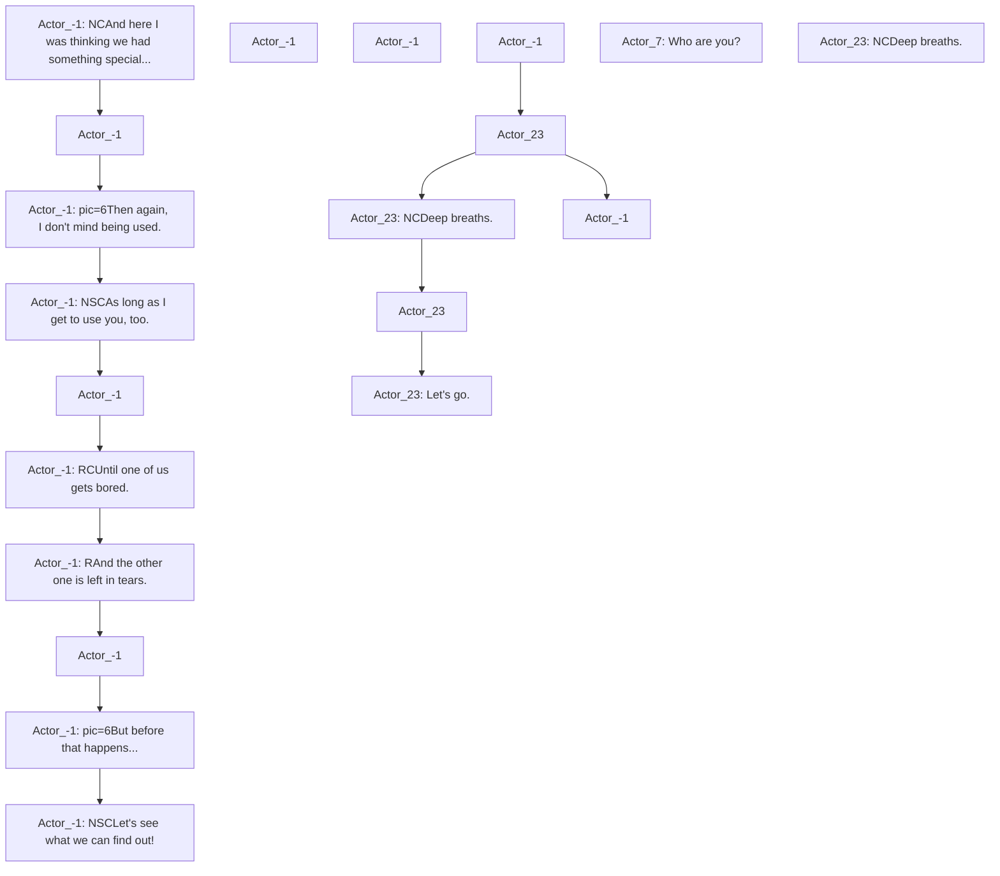

# Ionia/Aion/EnKAD 3

```mermaid
graph TD
    28_0["Actor_-1"]
    28_1["Actor_23: NCDeep breaths."]
    28_4["Actor_23"]
    28_5["Actor_23"]
    28_19["Actor_-1"]
    28_26["Actor_-1"]
    28_29["Actor_-1: NCAnd here I was thinking we had something special..."]
    28_30["Actor_-1"]
    28_31["Actor_-1: pic=6Then again, I don't mind being used."]
    28_32["Actor_-1: NSCAs long as I get to use you, too."]
    28_33["Actor_-1"]
    28_34["Actor_-1: pic=6But before that happens..."]
    28_36["Actor_-1: NSCLet's see what we can find out!"]
    28_40["Actor_-1: RCUntil one of us gets bored."]
    28_41["Actor_-1: RAnd the other one is left in tears."]
    28_42["Actor_-1"]
    28_70["Actor_-1"]
    28_75["Actor_7: Who are you?"]
    28_76["Actor_23: NCDeep breaths."]
    28_77["Actor_23: Let's go."]
    28_0 --> 28_4
    28_1 --> 28_5
    28_4 --> 28_1
    28_4 --> 28_70
    28_5 --> 28_77
    28_29 --> 28_30
    28_30 --> 28_31
    28_31 --> 28_32
    28_32 --> 28_33
    28_33 --> 28_40
    28_34 --> 28_36
    28_40 --> 28_41
    28_41 --> 28_42
    28_42 --> 28_34
```