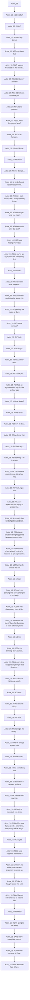

# Ionia/Aion/EnKaD Barracks/EV002

```mermaid
graph TD
    471_0["Actor_16"]
    471_1["Actor_16: NGDorothy?"]
    471_2["Actor_10: NHm?"]
    471_3["Actor_10: NSOh, hey Lorna!"]
    471_4["Actor_10: NSSorry about that."]
    471_5["Actor_10: NSCI was so focussed on the sheets..."]
    471_6["Actor_16: RGDDon't worry about it!"]
    471_7["Actor_16: NGI didn't mean to startle you."]
    471_8["Actor_10: NSCIt's no problem."]
    471_9["Actor_10: NSSo, what brings you here?"]
    471_10["Actor_16: RCTo be honest..."]
    471_11["Actor_16: NI don't know."]
    471_12["Actor_10: NEHuh?"]
    471_13["Actor_16: RCThe thing is..."]
    471_14["Actor_16: NI kind of want to talk to someone."]
    471_15["Actor_16: RCBut it feels like no one's really listening to me."]
    471_16["Actor_10: NCI think I get what you mean."]
    471_17["Actor_10: NSWant me to give it a shot?"]
    471_18["Actor_16: RSCI was hoping you'd ask."]
    471_19["Actor_16: NBut you've got to promise me something, first."]
    471_20["Actor_10: NYeah?"]
    471_21["Actor_16: RCNo matter what happens..."]
    471_22["Actor_16: NYou can't tell anybody else about this."]
    471_23["Actor_16: SEspecially not Atlas, or Eury."]
    471_24["Actor_10: NEIt's that serious?"]
    471_25["Actor_16: RCYeah."]
    471_26["Actor_10: NSCAlright."]
    471_27["Actor_10: NSYou got my word."]
    471_28["Actor_16: NSThank you."]
    471_29["Actor_16: RCI had an argument with my sis, like an hour ago."]
    471_30["Actor_10: NWhat about?"]
    471_31["Actor_16: NThe usual."]
    471_32["Actor_16: RCDon't do this..."]
    471_33["Actor_16: SStop doing that."]
    471_34["Actor_16: RCBasically..."]
    471_35["Actor_16: NEverything I do is wrong."]
    471_36["Actor_10: RCI'm sure she doesn't mean it in a bad way."]
    471_37["Actor_16: RCYeah, I get that."]
    471_38["Actor_16: RCAnd I appreciate her trying to protect me."]
    471_39["Actor_16: NHonestly, I've kind of gotten used to it."]
    471_40["Actor_16: RCBut ever since the thing happened between me and Atlas..."]
    471_41["Actor_16: NIt feels like she's actively looking for reasons to get angry at me."]
    471_42["Actor_10: NCThat hardly sounds like her."]
    471_43["Actor_16: NYeah."]
    471_44["Actor_16: SThere's no denying that she's changed a lot, lately."]
    471_45["Actor_16: RCShe was always very fond of him."]
    471_46["Actor_16: NBut now the two of them hardly speak to each other anymore."]
    471_47["Actor_10: NCHm."]
    471_48["Actor_16: RCSo I'm thinking she's jealous."]
    471_49["Actor_16: NBut every time I suggest anything in that direction..."]
    471_50["Actor_16: RCIt's like I'm flicking a switch."]
    471_51["Actor_10: NCI see..."]
    471_52["Actor_10: NThat sounds tricky."]
    471_53["Actor_16: RCYeah."]
    471_54["Actor_16: RCDon't get me wrong..."]
    471_55["Actor_16: NWe've always argued a lot."]
    471_56["Actor_16: RCBut today..."]
    471_57["Actor_16: NWas something else."]
    471_58["Actor_16: SI don't think I can ever go back."]
    471_59["Actor_10: NCPlease don't say that."]
    471_60["Actor_10: NFamily is important, you know."]
    471_61["Actor_10: NSAnd I'm sure if you give it a bit of time, everything will be alright."]
    471_62["Actor_16: RCMaybe."]
    471_63["Actor_16: NBut what happens afterwards?"]
    471_64["Actor_16: NThere's no telling how the next argument is gonna go."]
    471_65["Actor_16: RCLike, I thought about this a lot."]
    471_66["Actor_16: NAnd there's only one way to resolve this."]
    471_67["Actor_10: NWhat?"]
    471_68["Actor_16: RCI'm going to run away."]
    471_69["Actor_16: SAnd leave everything behind."]
    471_70["Actor_16: RCNot only because of Eury..."]
    471_71["Actor_16: NBut because I hate it here."]
    471_0 --> 471_1
    471_1 --> 471_2
    471_2 --> 471_3
    471_3 --> 471_4
    471_4 --> 471_5
    471_5 --> 471_6
    471_6 --> 471_7
    471_7 --> 471_8
    471_8 --> 471_9
    471_9 --> 471_10
    471_10 --> 471_11
    471_11 --> 471_12
    471_12 --> 471_13
    471_13 --> 471_14
    471_14 --> 471_15
    471_15 --> 471_16
    471_16 --> 471_17
    471_17 --> 471_18
    471_18 --> 471_19
    471_19 --> 471_20
    471_20 --> 471_21
    471_21 --> 471_22
    471_22 --> 471_23
    471_23 --> 471_24
    471_24 --> 471_25
    471_25 --> 471_26
    471_26 --> 471_27
    471_27 --> 471_28
    471_28 --> 471_29
    471_29 --> 471_30
    471_30 --> 471_31
    471_31 --> 471_32
    471_32 --> 471_33
    471_33 --> 471_34
    471_34 --> 471_35
    471_35 --> 471_36
    471_36 --> 471_37
    471_37 --> 471_38
    471_38 --> 471_39
    471_39 --> 471_40
    471_40 --> 471_41
    471_41 --> 471_42
    471_42 --> 471_43
    471_43 --> 471_44
    471_44 --> 471_45
    471_45 --> 471_46
    471_46 --> 471_47
    471_47 --> 471_48
    471_48 --> 471_49
    471_49 --> 471_50
    471_50 --> 471_51
    471_51 --> 471_52
    471_52 --> 471_53
    471_53 --> 471_54
    471_54 --> 471_55
    471_55 --> 471_56
    471_56 --> 471_57
    471_57 --> 471_58
    471_58 --> 471_59
    471_59 --> 471_60
    471_60 --> 471_61
    471_61 --> 471_62
    471_62 --> 471_63
    471_63 --> 471_64
    471_64 --> 471_65
    471_65 --> 471_66
    471_66 --> 471_67
    471_67 --> 471_68
    471_68 --> 471_69
    471_69 --> 471_70
    471_70 --> 471_71
```