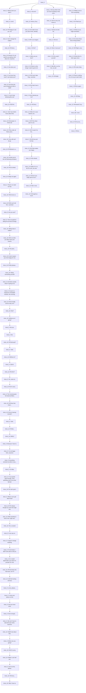

# Ionia/Aion/Farago Apartment/Eury

```mermaid
graph TD
    472_0["Actor_5"]
    472_1["Actor_5: Where have you been?"]
    472_2["Actor_5: Lorna!"]
    472_3["Actor_16: RCHappy to see you, too."]
    472_4["Actor_5: Don't change the subject."]
    472_5["Actor_16: RCSorry."]
    472_6["Actor_16: NGuess I'm not used to you giving a shit about me, anymore."]
    472_7["Actor_5: How dare you!"]
    472_8["Actor_5: You know how much I care about you?"]
    472_9["Actor_16: NIs that why you're treating me like a child?"]
    472_10["Actor_5: If you'd stop behaving like one!"]
    472_11["Actor_16: RSCHm."]
    472_12["Actor_5: I don't see what's funny about that."]
    472_13["Actor_16: RCActually, it's kinda sad."]
    472_14["Actor_16: NThat, after all these years..."]
    472_15["Actor_16: SYou still can't let go."]
    472_16["Actor_16: RCBetween us..."]
    472_17["Actor_16: NI think you're the one behaving immature."]
    472_18["Actor_16: RCGo ahead."]
    472_19["Actor_16: SSlap me again."]
    472_20["Actor_5: There's no need for that."]
    472_21["Actor_16: RSCCome on."]
    472_22["Actor_16: RGDI won't tell him, I promise!"]
    472_23["Actor_5: Are you sure?"]
    472_24["Actor_5: You're so good at telling him all kind of things."]
    472_25["Actor_16: NWhat does it matter?"]
    472_26["Actor_16: RCIt's not like you didn't have your chance."]
    472_27["Actor_16: RCListen..."]
    472_28["Actor_16: NI don't expect you to be happy for me."]
    472_29["Actor_16: RCBut please..."]
    472_30["Actor_16: NStop tormenting yourself."]
    472_31["Actor_5: And that's exactly what I'm going to do."]
    472_32["Actor_5: I've put in a request for immediate transfer, this morning."]
    472_33["Actor_16: RCIt's finally come to that, hm?"]
    472_34["Actor_16: NSo?"]
    472_35["Actor_16: SWhere am I going?"]
    472_36["Actor_5: Not you."]
    472_37["Actor_5: Me."]
    472_38["Actor_16: RCSeriously?"]
    472_39["Actor_5: Yeah."]
    472_40["Actor_16: NWhere to?"]
    472_41["Actor_5: CoExA."]
    472_42["Actor_16: RCUhm?"]
    472_43["Actor_5: Oh, come on."]
    472_44["Actor_16: RCI'm sorry."]
    472_45["Actor_5: The Commissariat for External Affairs."]
    472_46["Actor_16: RCDoes that mean..."]
    472_47["Actor_16: NYou're leaving EnKAD?"]
    472_48["Actor_5: Yeah."]
    472_49["Actor_16: RCBut..."]
    472_50["Actor_16: NWhy?"]
    472_51["Actor_5: Because I have to."]
    472_52["Actor_5: I'm not happy here, anymore."]
    472_53["Actor_5: Everything reminds me either of you..."]
    472_54["Actor_5: Or Atlas."]
    472_55["Actor_5: If my transfer goes through, I'll be spending most of my time abroad."]
    472_56["Actor_16: RCI don't get it."]
    472_57["Actor_5: What's not to get about that?"]
    472_58["Actor_16: RCI always thought you were the tough one."]
    472_59["Actor_16: NBut standing in front of me, right now..."]
    472_60["Actor_16: SIs a coward."]
    472_61["Actor_5: If you say so."]
    472_62["Actor_5: It doesn't change anything."]
    472_63["Actor_5: To be honest, I didn't even plan to tell you."]
    472_64["Actor_5: So I would appreciate if you kept it to yourself, for now."]
    472_65["Actor_16: RCAnd that's the real issue, isn't it?"]
    472_66["Actor_16: SAll this fucking secrecy!"]
    472_67["Actor_5: Lorna, please..."]
    472_68["Actor_5: I know your stance on this."]
    472_69["Actor_5: And you know mine."]
    472_70["Actor_5: Soon enough..."]
    472_71["Actor_5: We won't have to deal with each other, anymore."]
    472_72["Actor_16: SWe'll see about that."]
    472_73["Actor_5: Where are you going?"]
    472_74["Actor_16: RSCI'm sorry."]
    472_75["Actor_16: NSBut I can't tell you."]
    472_76["Actor_5: Don't do this, please."]
    472_77["Actor_16: RCSorry..."]
    472_78["Actor_16: NBut I have to."]
    472_79["Actor_5: NLorna?"]
    472_80["Actor_13: NSorry, Eury."]
    472_81["Actor_13: NCI didn't know you were home, already."]
    472_82["Actor_5: SPCI can imagine."]
    472_83["Actor_5: SCSo?"]
    472_84["Actor_5: SWhy are you here?"]
    472_85["Actor_13: NThere's a few things I need to get rid of."]
    472_86["Actor_13: NCIt won't take long, I promise."]
    472_87["Actor_5: SCSo that's how it is."]
    472_88["Actor_5: SJust cleaning up, hm?"]
    472_89["Actor_13: NCSorry."]
    472_90["Actor_13: NBut it's in your interest, too."]
    472_91["Actor_5: SPCThe sheer guts on you."]
    472_92["Actor_5: SCIf it wasn't for her..."]
    472_93["Actor_5: SI'd kill you just for that."]
    472_94["Actor_13: NCIf that makes you happy."]
    472_95["Actor_13: NGo ahead."]
    472_96["Actor_13: NCBut I'm in a bit of a rush, you see."]
    472_97["Actor_13: NCSo if you really want to do it..."]
    472_98["Actor_13: NDo it now."]
    472_99["Actor_13: NI thought as much."]
    472_100["Actor_5: SIf you think I'd let you touch anything in that room-"]
    472_101["Actor_13: NCI'm sorry, but I have to."]
    472_102["Actor_5: SCGive me the list."]
    472_103["Actor_5: SI'll do it."]
    472_104["Actor_13: NCan I trust you?"]
    472_105["Actor_5: SCYou said it yourself."]
    472_106["Actor_5: SMy life is on the line, as well."]
    472_107["Actor_13: NCAlright."]
    472_108["Actor_13: NMake sure to burn everything."]
    472_109["Actor_5: SCThank you."]
    472_110["Actor_5: SCBut as you might remember..."]
    472_111["Actor_5: SI've done these kind of things before."]
    472_112["Actor_13: NPCRight, sorry."]
    472_113["Actor_13: NFeels like it's been ages since-"]
    472_114["Actor_5: SPCListen Atlas."]
    472_115["Actor_5: SThere's nothing for us to say to each other."]
    472_116["Actor_5: SPEver again."]
    472_117["Actor_13: NCOkay."]
    472_118["Actor_13: NFarewell, Eury."]
    472_119["Actor_461: none"]
    472_120["Actor_5: RCYou too..."]
    472_121["Actor_5: RÁron."]
    472_0 --> 472_1
    472_0 --> 472_79
    472_0 --> 472_100
    472_0 --> 472_108
    472_1 --> 472_2
    472_2 --> 472_3
    472_3 --> 472_4
    472_4 --> 472_5
    472_5 --> 472_6
    472_6 --> 472_7
    472_7 --> 472_8
    472_8 --> 472_9
    472_9 --> 472_10
    472_10 --> 472_11
    472_11 --> 472_12
    472_12 --> 472_13
    472_13 --> 472_14
    472_14 --> 472_15
    472_15 --> 472_16
    472_16 --> 472_17
    472_17 --> 472_18
    472_18 --> 472_19
    472_19 --> 472_20
    472_20 --> 472_21
    472_21 --> 472_22
    472_22 --> 472_23
    472_23 --> 472_24
    472_24 --> 472_25
    472_25 --> 472_26
    472_26 --> 472_27
    472_27 --> 472_28
    472_28 --> 472_29
    472_29 --> 472_30
    472_30 --> 472_31
    472_31 --> 472_32
    472_32 --> 472_33
    472_33 --> 472_34
    472_34 --> 472_35
    472_35 --> 472_36
    472_36 --> 472_37
    472_37 --> 472_38
    472_38 --> 472_39
    472_39 --> 472_40
    472_40 --> 472_41
    472_41 --> 472_42
    472_42 --> 472_43
    472_43 --> 472_44
    472_44 --> 472_45
    472_45 --> 472_46
    472_46 --> 472_47
    472_47 --> 472_48
    472_48 --> 472_49
    472_49 --> 472_50
    472_50 --> 472_51
    472_51 --> 472_52
    472_52 --> 472_53
    472_53 --> 472_54
    472_54 --> 472_55
    472_55 --> 472_56
    472_56 --> 472_57
    472_57 --> 472_58
    472_58 --> 472_59
    472_59 --> 472_60
    472_60 --> 472_61
    472_61 --> 472_62
    472_62 --> 472_63
    472_63 --> 472_64
    472_64 --> 472_65
    472_65 --> 472_66
    472_66 --> 472_67
    472_67 --> 472_68
    472_68 --> 472_69
    472_69 --> 472_70
    472_70 --> 472_71
    472_71 --> 472_72
    472_72 --> 472_73
    472_73 --> 472_74
    472_74 --> 472_75
    472_75 --> 472_76
    472_76 --> 472_77
    472_77 --> 472_78
    472_79 --> 472_80
    472_80 --> 472_81
    472_81 --> 472_82
    472_82 --> 472_83
    472_83 --> 472_84
    472_84 --> 472_85
    472_85 --> 472_86
    472_86 --> 472_87
    472_87 --> 472_88
    472_88 --> 472_89
    472_89 --> 472_90
    472_90 --> 472_91
    472_91 --> 472_92
    472_92 --> 472_93
    472_93 --> 472_94
    472_94 --> 472_95
    472_95 --> 472_96
    472_96 --> 472_97
    472_97 --> 472_98
    472_98 --> 472_99
    472_100 --> 472_101
    472_101 --> 472_102
    472_102 --> 472_103
    472_103 --> 472_104
    472_104 --> 472_105
    472_105 --> 472_106
    472_106 --> 472_107
    472_108 --> 472_109
    472_109 --> 472_110
    472_110 --> 472_111
    472_111 --> 472_112
    472_112 --> 472_113
    472_113 --> 472_114
    472_114 --> 472_115
    472_115 --> 472_116
    472_116 --> 472_117
    472_117 --> 472_118
    472_118 --> 472_119
    472_119 --> 472_120
    472_120 --> 472_121
```