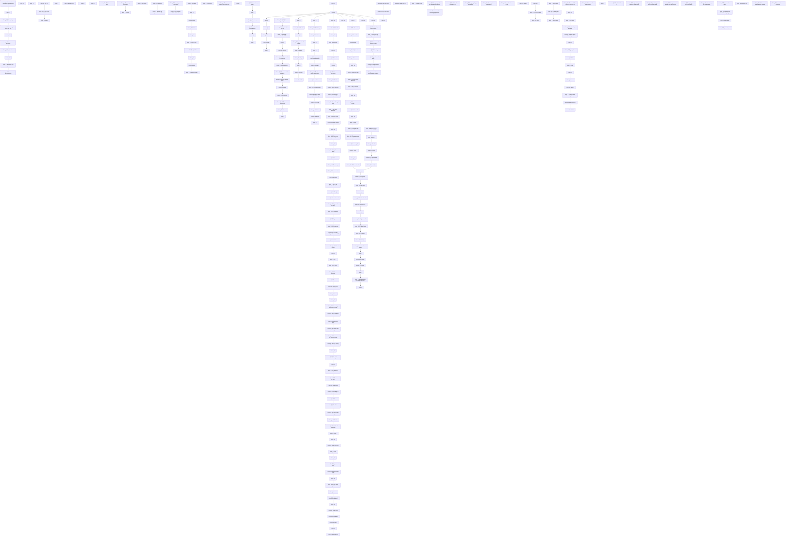

# Ionia/Aion/Farago Apartment/ImmigrAtion

```mermaid
graph TD
    32_0["Actor_-1"]
    32_4["Actor_20"]
    32_19["Actor_-1"]
    32_26["Actor_-1"]
    32_29["Actor_-1: 2And here I was thinking we had something special..."]
    32_30["Actor_-1"]
    32_31["Actor_-1: 6Then again, I don't mind being used."]
    32_32["Actor_-1: 5As long as I get to use you, too."]
    32_33["Actor_-1"]
    32_34["Actor_-1: 6But before that happens..."]
    32_36["Actor_-1: 5Let's see what we can find out!"]
    32_40["Actor_-1: 8Until one of us gets bored."]
    32_41["Actor_-1: 7And the other one is left in tears."]
    32_42["Actor_-1"]
    32_70["Actor_-1"]
    32_75["Actor_7: Who are you?"]
    32_76["Actor_5"]
    32_77["Actor_20: Clear."]
    32_79["Actor_5"]
    32_80["Actor_20"]
    32_82["Actor_5: Okay."]
    32_83["Actor_9"]
    32_84["Actor_16: NGDWho's a good boy?"]
    32_85["Actor_16: NSThat's right! You are!"]
    32_86["Actor_5: 5"]
    32_88["Actor_5: 5Lorna."]
    32_89["Actor_16"]
    32_90["Actor_16: NSVicky!"]
    32_91["Actor_16: NGDTake a look at this pupper!"]
    32_92["Actor_5: NSDIt's adorable."]
    32_93["Actor_5: NSBut we wanted to unpack."]
    32_94["Actor_16: NSI'll be there in a sec-"]
    32_95["Actor_5: NSDNow."]
    32_96["Actor_16: 5I'll be there in a sec-"]
    32_97["Actor_16: NSCAlright."]
    32_98["Actor_16: NSPleasure meeting you!"]
    32_101["Actor_5: NSAlready making friends?"]
    32_102["Actor_5: 6She's very excited about "]
    32_103["Actor_16"]
    32_104["Actor_20"]
    32_106["Actor_16: NWWoah!"]
    32_110["Actor_-1: Over there?"]
    32_111["Actor_20: Is your sister still outside?"]
    32_112["Actor_16: NSMhm."]
    32_113["Actor_20: Okay."]
    32_114["Actor_20"]
    32_115["Actor_16: NCCleo?"]
    32_116["Actor_20: Hm?"]
    32_117["Actor_16: NCNothing."]
    32_118["Actor_20: Alright."]
    32_124["Actor_20: It shouldn't."]
    32_125["Actor_-1: 7What's that supposed to mean?"]
    32_127["Actor_20: I'm saying even if she's mad..."]
    32_128["Actor_20: You shouldn't feel bad about it."]
    32_129["Actor_-1"]
    32_134["Actor_5: Cleo, have you met our neighbours?"]
    32_135["Actor_5: NCThere's a woman living in 305."]
    32_136["Actor_20: What about her?"]
    32_137["Actor_5: Would you mind seeing what she's up to?"]
    32_138["Actor_20: Just that?"]
    32_141["Actor_5: NCYeah."]
    32_142["Actor_5: Thank you."]
    32_145["Actor_20"]
    32_146["Actor_25: Likewise!"]
    32_147["Actor_20: Should I?"]
    32_148["Actor_5: Ioulia Metaxas."]
    32_150["Actor_20"]
    32_151["Actor_16"]
    32_152["Actor_20: Test Test"]
    32_153["Actor_16: NWIs that!?"]
    32_154["Actor_20: Is your sis still outside?"]
    32_155["Actor_-1: 5Mhm."]
    32_156["Actor_16: RNo way!"]
    32_157["Actor_-1: 7Really you?"]
    32_158["Actor_-1"]
    32_159["Actor_16"]
    32_160["Actor_16: RCome in."]
    32_161["Actor_5"]
    32_162["Actor_5: NSYou've found your room?"]
    32_163["Actor_16: NCYeah."]
    32_164["Actor_16: Lime's here, too."]
    32_165["Actor_5: NSCLife is full of surprises, isn't it?"]
    32_166["Actor_16: RHow did he get here?"]
    32_167["Actor_5: NSCGood question."]
    32_168["Actor_16: RSWas it you?"]
    32_169["Actor_5: 6Someone must've brought him with."]
    32_170["Actor_-1"]
    32_171["Actor_-1"]
    32_172["Actor_5: NSI asked politely."]
    32_173["Actor_16"]
    32_174["Actor_16: RSThank you so, so much!!"]
    32_175["Actor_16: RVicky? Are you okay?"]
    32_176["Actor_5: NSCI'm fine."]
    32_177["Actor_5: NSDon't worry."]
    32_178["Actor_16: Are you sure?"]
    32_179["Actor_5: NSCYes!"]
    32_180["Actor_5: NSI'm just relieved you like it here."]
    32_181["Actor_16: NCReally?"]
    32_182["Actor_16: You aren't mad?"]
    32_183["Actor_5: NSWhy would I be mad?"]
    32_184["Actor_16: RCWe had to run because of me."]
    32_185["Actor_5: NCDid you want us to run?"]
    32_186["Actor_16: SOf course not!"]
    32_187["Actor_5: NSThen why would you blame yourself?"]
    32_188["Actor_16: NCI don't know."]
    32_189["Actor_16: It just feels like I should."]
    32_190["Actor_-1"]
    32_191["Actor_5: RC..."]
    32_192["Actor_16: RCVicky."]
    32_193["Actor_5: NCI'm sorry."]
    32_194["Actor_16: NSYou don't need to be!"]
    32_195["Actor_27: 5It's okay."]
    32_196["Actor_5: 19Is it?"]
    32_197["Actor_-1"]
    32_198["Actor_27: 5Yeah!"]
    32_199["Actor_-1"]
    32_200["Actor_27: 6We're here."]
    32_201["Actor_27: 5That's all that matters!"]
    32_202["Actor_-1"]
    32_203["Actor_5: 6Good."]
    32_204["Actor_5: 5Thank you, Soph."]
    32_205["Actor_16: NGDThank you for wha–"]
    32_206["Actor_16: SWait a sec!"]
    32_207["Actor_16: RYou told me to forget my name!"]
    32_209["Actor_5: NSCI know."]
    32_210["Actor_16: You said it to me yesterday!"]
    32_211["Actor_16: RHuh-"]
    32_212["Actor_5: Lorna."]
    32_213["Actor_5: 5Just listen to me, okay?"]
    32_214["Actor_-1"]
    32_215["Actor_5: 6Whatever's going to happen next."]
    32_216["Actor_5: 5Remember what you said to me."]
    32_217["Actor_5"]
    32_218["Actor_-1"]
    32_219["Actor_5: NSBut that's history."]
    32_220["Actor_5"]
    32_222["Actor_5: I do."]
    32_223["Actor_5: NCBut it's the truth."]
    32_224["Actor_5: 5There's no need to be."]
    32_225["Actor_-1"]
    32_226["Actor_5: You're feeling guilty because of me."]
    32_227["Actor_16: That's not what I said!"]
    32_228["Actor_5: I told myself I was protecting you."]
    32_229["Actor_5: NCWhen I was just afraid let you go."]
    32_230["Actor_16: That's no reason to feel bad about yourself!"]
    32_231["Actor_5: NSThank you, Sophia."]
    32_232["Actor_5: 6It's not your fault."]
    32_233["Actor_5: SWitness a world without a curtain."]
    32_235["Actor_5: I couldn't let go."]
    32_236["Actor_5: I couldn't let go."]
    32_238["Actor_5: Where people like us can forgive ourselves."]
    32_239["Actor_-1"]
    32_240["Actor_5: But it's time for me to grow up."]
    32_241["Actor_-1"]
    32_242["Actor_5: SBeyond life and death."]
    32_243["Actor_27: Do we really need another world for that?"]
    32_244["Actor_16: NCI don't know."]
    32_245["Actor_5: NSCI'm glad you see it that way."]
    32_246["Actor_-1"]
    32_248["Actor_5: NSCDid I?"]
    32_249["Actor_5: NSFeels like it's been years."]
    32_250["Actor_5: Steady."]
    32_251["Actor_16: RWhat just happened?"]
    32_252["Actor_5: The truth."]
    32_253["Actor_27: 3Are you getting somewhere?"]
    32_254["Actor_27: 3Are you getting somewhere?"]
    32_255["Actor_16: SWhat was that?"]
    32_256["Actor_16"]
    32_257["Actor_16: SDid you hear it that?"]
    32_258["Actor_16"]
    32_259["Actor_5: You need to listen to me."]
    32_260["Actor_16"]
    32_261["Actor_5: You need to listen to me."]
    32_262["Actor_16: SThere it was again!"]
    32_263["Actor_5: Lorna."]
    32_264["Actor_5: SLook at me!"]
    32_265["Actor_16: SCMy head."]
    32_266["Actor_16"]
    32_267["Actor_5: NCIt's alright."]
    32_268["Actor_5: It'll pass."]
    32_269["Actor_5: NCBreathe in."]
    32_270["Actor_5: Breathe out."]
    32_271["Actor_16: W-what?"]
    32_272["Actor_27: Are we?"]
    32_273["Actor_16: Where are we?"]
    32_274["Actor_5: NCI don't know about you."]
    32_275["Actor_16: Weren't we at home?"]
    32_276["Actor_5: Which one?"]
    32_277["Actor_16: Aion."]
    32_278["Actor_5: NCI thought we just moved in."]
    32_279["Actor_16: SThat was years ago!"]
    32_280["Actor_5: How many?"]
    32_281["Actor_16: 3"]
    32_282["Actor_5: Can you prove it?"]
    32_283["Actor_16: 3Huh?"]
    32_286["Actor_5: When?"]
    32_289["Actor_5: We're here."]
    32_290["Actor_16: 3It damn well matters to me!"]
    32_291["Actor_5: We're here."]
    32_295["Actor_5: Where's your service card?"]
    32_297["Actor_16: Right here."]
    32_298["Actor_16: RIssued 1919."]
    32_299["Actor_5: Is that your final word?"]
    32_303["Actor_16: 3Then tell me what the fuck is going on!"]
    32_304["Actor_5: 2Even better."]
    32_305["Actor_16: 3Because it's the only thing you ever do!"]
    32_306["Actor_16"]
    32_307["Actor_5: 2I'm sorry."]
    32_308["Actor_16: 4Don't fucking apologise!"]
    32_309["Actor_16: 3Just tell me the what's going on!"]
    32_310["Actor_16: 3Just tell me the truth already!"]
    32_311["Actor_-1"]
    32_312["Actor_5: Do you really want to know?"]
    32_314["Actor_5: What does it say?"]
    32_315["Actor_16: 3I do!"]
    32_316["Actor_5: 2Okay."]
    32_317["Actor_-1"]
    32_318["Actor_5: Lorna."]
    32_319["Actor_16: 3What?"]
    32_320["Actor_5: 6I should have said so a long time ago."]
    32_321["Actor_5: 5I'm proud of you."]
    32_322["Actor_16: 3Huh?"]
    32_323["Actor_5"]
    32_324["Actor_-1"]
    32_325["Actor_16"]
    32_326["Actor_16"]
    32_327["Actor_16"]
    32_328["Actor_16"]
    32_330["Actor_5: 2It's a lot to take in."]
    32_331["Actor_5: 2I'm just trying to make you understand."]
    32_332["Actor_5: 2I'm just trying to make you understand."]
    32_336["Actor_5: 2Since you've already got it figured out."]
    32_337["Actor_5: NCYou've always hated pretense."]
    32_338["Actor_5: So I'll put it into words you understand."]
    32_339["Actor_5: Everything you ever knew is gone."]
    32_340["Actor_5: NCHumanity beyond good and evil."]
    32_341["Actor_5: There is no truth, only life and death."]
    32_344["Actor_5: This is as real as it gets."]
    32_345["Actor_5: I'll prove it to you."]
    32_346["Actor_5: NCKeep your feet to the ground, Lorna."]
    32_347["Actor_5: Because I won't hold your hand anymore."]
    32_348["Actor_16"]
    32_349["Actor_16"]
    32_350["Actor_5"]
    32_351["Actor_5: NCLorna?"]
    32_352["Actor_16: RYeah?"]
    32_353["Actor_5: NKeep your feet on the ground, okay?"]
    32_354["Actor_5"]
    32_355["Actor_16"]
    32_356["Actor_16: SI do."]
    32_357["Actor_16: 3Or was it six?"]
    32_360["Actor_-1"]
    32_362["Actor_5: NCIs that the year we're in?"]
    32_364["Actor_16: Possibly."]
    32_366["Actor_-1"]
    32_367["Actor_5: NCAlright."]
    32_368["Actor_5: Let's refresh your memory."]
    32_369["Actor_5: But I'm exactly where I was."]
    32_370["Actor_27: 7You're not supposed to call me that."]
    32_371["Actor_27: You said it to me yesterday!"]
    32_372["Actor_-1"]
    32_373["Actor_5"]
    32_374["Actor_16: SFive."]
    32_375["Actor_16: But you do you remember that I left?"]
    32_376["Actor_16: S1918."]
    32_377["Actor_16: RYou're shivering."]
    32_378["Actor_16: SCOr was it six?"]
    32_379["Actor_-1"]
    32_380["Actor_16: NPMaybe."]
    32_381["Actor_-1"]
    32_0 --> 32_83
    32_4 --> 32_76
    32_29 --> 32_30
    32_30 --> 32_31
    32_31 --> 32_32
    32_32 --> 32_33
    32_33 --> 32_40
    32_34 --> 32_36
    32_40 --> 32_41
    32_41 --> 32_42
    32_42 --> 32_34
    32_76 --> 32_77
    32_77 --> 32_82
    32_82 --> 32_79
    32_83 --> 32_4
    32_83 --> 32_84
    32_83 --> 32_103
    32_83 --> 32_218
    32_83 --> 32_151
    32_83 --> 32_325
    32_83 --> 32_323
    32_83 --> 32_348
    32_83 --> 32_349
    32_84 --> 32_85
    32_85 --> 32_101
    32_89 --> 32_90
    32_90 --> 32_91
    32_91 --> 32_92
    32_92 --> 32_93
    32_93 --> 32_94
    32_94 --> 32_95
    32_95 --> 32_97
    32_97 --> 32_98
    32_98 --> 32_146
    32_101 --> 32_89
    32_102 --> 32_88
    32_103 --> 32_106
    32_104 --> 32_111
    32_106 --> 32_104
    32_111 --> 32_112
    32_112 --> 32_113
    32_113 --> 32_114
    32_114 --> 32_115
    32_115 --> 32_116
    32_117 --> 32_118
    32_118 --> 32_150
    32_124 --> 32_125
    32_127 --> 32_128
    32_129 --> 32_134
    32_134 --> 32_147
    32_135 --> 32_148
    32_136 --> 32_137
    32_137 --> 32_138
    32_138 --> 32_141
    32_141 --> 32_142
    32_142 --> 32_145
    32_146 --> 32_373
    32_147 --> 32_135
    32_148 --> 32_136
    32_150 --> 32_129
    32_151 --> 32_153
    32_152 --> 32_154
    32_153 --> 32_159
    32_154 --> 32_155
    32_156 --> 32_158
    32_158 --> 32_160
    32_159 --> 32_156
    32_160 --> 32_161
    32_161 --> 32_162
    32_162 --> 32_163
    32_163 --> 32_164
    32_164 --> 32_165
    32_165 --> 32_166
    32_166 --> 32_167
    32_167 --> 32_168
    32_168 --> 32_172
    32_171 --> 32_175
    32_172 --> 32_173
    32_173 --> 32_174
    32_174 --> 32_171
    32_175 --> 32_176
    32_176 --> 32_177
    32_177 --> 32_178
    32_178 --> 32_179
    32_179 --> 32_180
    32_180 --> 32_181
    32_181 --> 32_182
    32_182 --> 32_183
    32_183 --> 32_184
    32_184 --> 32_185
    32_185 --> 32_186
    32_186 --> 32_187
    32_187 --> 32_188
    32_188 --> 32_189
    32_189 --> 32_190
    32_190 --> 32_191
    32_191 --> 32_192
    32_192 --> 32_377
    32_193 --> 32_194
    32_194 --> 32_222
    32_195 --> 32_197
    32_196 --> 32_198
    32_197 --> 32_196
    32_198 --> 32_199
    32_199 --> 32_200
    32_200 --> 32_201
    32_201 --> 32_202
    32_202 --> 32_203
    32_203 --> 32_204
    32_205 --> 32_206
    32_206 --> 32_207
    32_207 --> 32_209
    32_209 --> 32_219
    32_210 --> 32_248
    32_211 --> 32_256
    32_212 --> 32_258
    32_213 --> 32_214
    32_214 --> 32_215
    32_215 --> 32_216
    32_216 --> 32_217
    32_217 --> 32_220
    32_218 --> 32_117
    32_219 --> 32_210
    32_222 --> 32_225
    32_223 --> 32_228
    32_224 --> 32_239
    32_225 --> 32_226
    32_226 --> 32_227
    32_227 --> 32_223
    32_228 --> 32_229
    32_229 --> 32_230
    32_230 --> 32_241
    32_231 --> 32_205
    32_232 --> 32_224
    32_233 --> 32_340
    32_238 --> 32_243
    32_241 --> 32_245
    32_242 --> 32_346
    32_244 --> 32_380
    32_245 --> 32_246
    32_246 --> 32_231
    32_248 --> 32_249
    32_249 --> 32_211
    32_250 --> 32_251
    32_251 --> 32_252
    32_252 --> 32_326
    32_255 --> 32_212
    32_256 --> 32_255
    32_257 --> 32_259
    32_258 --> 32_257
    32_259 --> 32_260
    32_260 --> 32_262
    32_262 --> 32_263
    32_263 --> 32_264
    32_264 --> 32_266
    32_265 --> 32_267
    32_266 --> 32_265
    32_267 --> 32_268
    32_268 --> 32_372
    32_270 --> 32_271
    32_271 --> 32_250
    32_273 --> 32_274
    32_274 --> 32_369
    32_275 --> 32_276
    32_276 --> 32_328
    32_277 --> 32_278
    32_278 --> 32_279
    32_279 --> 32_280
    32_280 --> 32_374
    32_281 --> 32_282
    32_282 --> 32_283
    32_286 --> 32_376
    32_289 --> 32_290
    32_290 --> 32_291
    32_295 --> 32_297
    32_297 --> 32_366
    32_298 --> 32_381
    32_299 --> 32_244
    32_303 --> 32_304
    32_304 --> 32_345
    32_305 --> 32_306
    32_306 --> 32_307
    32_307 --> 32_308
    32_308 --> 32_309
    32_309 --> 32_311
    32_311 --> 32_312
    32_312 --> 32_315
    32_314 --> 32_298
    32_315 --> 32_316
    32_316 --> 32_317
    32_317 --> 32_318
    32_318 --> 32_319
    32_319 --> 32_320
    32_320 --> 32_321
    32_321 --> 32_322
    32_323 --> 32_270
    32_326 --> 32_273
    32_327 --> 32_275
    32_328 --> 32_277
    32_337 --> 32_338
    32_338 --> 32_233
    32_340 --> 32_242
    32_344 --> 32_303
    32_346 --> 32_347
    32_349 --> 32_337
    32_350 --> 32_351
    32_351 --> 32_352
    32_352 --> 32_354
    32_353 --> 32_355
    32_354 --> 32_353
    32_356 --> 32_286
    32_360 --> 32_295
    32_362 --> 32_364
    32_364 --> 32_360
    32_366 --> 32_314
    32_367 --> 32_368
    32_368 --> 32_350
    32_369 --> 32_327
    32_372 --> 32_269
    32_374 --> 32_379
    32_375 --> 32_356
    32_376 --> 32_362
    32_377 --> 32_193
    32_378 --> 32_360
    32_379 --> 32_378
    32_380 --> 32_367
    32_381 --> 32_299
```