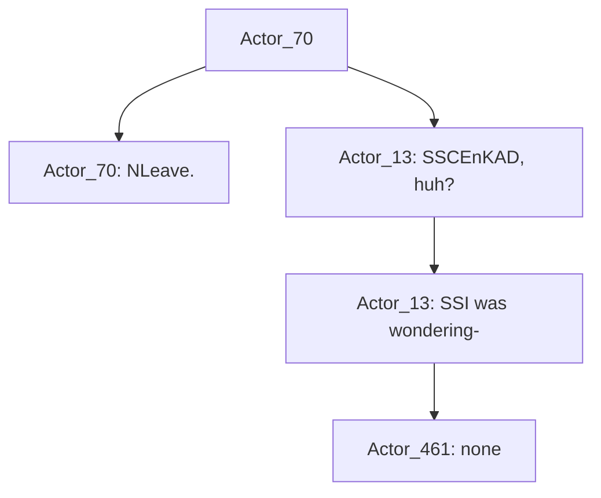

# Ionia/Aion/Interrogation Room Atlas/Guard

```mermaid
graph TD
    473_0["Actor_70"]
    473_1["Actor_70: NLeave."]
    473_2["Actor_13: SSCEnKAD, huh?"]
    473_3["Actor_13: SSI was wondering-"]
    473_4["Actor_461: none"]
    473_0 --> 473_1
    473_0 --> 473_2
    473_2 --> 473_3
    473_3 --> 473_4
```