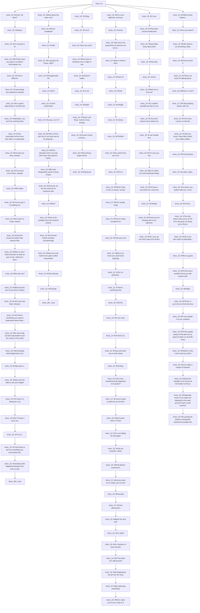

# Ionia/Aion/Prawnfield Briefing/Prawnfield Briefing

```mermaid
graph TD
    474_0["Actor_10"]
    474_1["Actor_10: SCCan I be blunt?"]
    474_2["Actor_19: NAlways."]
    474_3["Actor_10: SI'm not good a fit."]
    474_4["Actor_19: NSCThat's what you said to me before Hermingrad, too."]
    474_5["Actor_10: SCThis is different."]
    474_6["Actor_10: SI have barely any experience abroad."]
    474_7["Actor_19: NIt's a great opportunity to remedy that."]
    474_8["Actor_19: NCBesides, you won't be working alone."]
    474_9["Actor_19: NYour associates will be more than able to compensate."]
    474_10["Actor_10: NAnd who are they, exactly?"]
    474_11["Actor_19: NCYou know one of them, already."]
    474_12["Actor_19: NSIt's Atlas."]
    474_13["Actor_10: NCYou've got to be kidding me."]
    474_14["Actor_19: NHe's been to Trachi, before."]
    474_15["Actor_19: NCAnd he knows her better than anyone else."]
    474_16["Actor_19: NWhich is why I need someone to keep an eye on him, while he's there."]
    474_17["Actor_10: NBut why me?"]
    474_18["Actor_19: NSBecause the two of you have a history."]
    474_19["Actor_10: NI don't see how that's relevant."]
    474_20["Actor_19: NCThere's something you need to understand about Atlas..."]
    474_21["Actor_19: NHe can't help but feel responsible for all the misery in the world."]
    474_22["Actor_19: NSCIncluding what happened to you."]
    474_23["Actor_19: NCMy point is..."]
    474_24["Actor_19: NAtlas won't be able to see you straight."]
    474_25["Actor_19: NCI know I'm asking for a lot."]
    474_26["Actor_19: NSo I'll leave it up to you."]
    474_27["Actor_10: SIf I do it..."]
    474_28["Actor_10: SCYou'll have to tell me everything you know about him."]
    474_29["Actor_10: SIncluding what happened between him and my dad."]
    474_30["Actor_461: none"]
    474_31["Actor_10: NWhat about the other one?"]
    474_32["Actor_19: NFero's candidate?"]
    474_33["Actor_10: NYeah."]
    474_34["Actor_10: NIt's going to be Icarus, right?"]
    474_35["Actor_19: NSCApparently not."]
    474_36["Actor_10: SHm?"]
    474_37["Actor_10: SI don't understand."]
    474_38["Actor_19: NCurious, isn't it?"]
    474_39["Actor_19: NCHere is Fero, with one of our best men at his disposal..."]
    474_40["Actor_19: NSCAn operative who's not only been born and raised in Trachi..."]
    474_41["Actor_19: NBut also desperately wants to bring it back."]
    474_42["Actor_19: NCAnd yet, he has his mind set on someone else."]
    474_43["Actor_10: NWho?"]
    474_44["Actor_19: NOne of his protégés from the external branch."]
    474_45["Actor_19: NCA former CoExA member, unsurprisingly."]
    474_46["Actor_19: NHave you ever heard of an agent called Ganymede?"]
    474_47["Actor_10: NOnly hearsay."]
    474_48["Actor_19: NCExactly."]
    474_49["Actor_461: none"]
    474_50["Actor_10: SCOkay."]
    474_51["Actor_10: SI'll do it."]
    474_52["Actor_19: NAre you sure?"]
    474_53["Actor_19: NCNo harm in thinking it over a night or two."]
    474_54["Actor_10: SCDoesn't matter."]
    474_55["Actor_10: SI'm set."]
    474_56["Actor_19: NAlright."]
    474_57["Actor_10: SThere's one thing I need to know, though."]
    474_58["Actor_10: SCIf push comes to shove..."]
    474_59["Actor_19: NThe primary target will do."]
    474_60["Actor_10: SUnderstood."]
    474_61["Actor_13: NCI'm not a diplomat, mind you."]
    474_62["Actor_19: NI know."]
    474_63["Actor_19: NSCYou're not going there to hammer out terms..."]
    474_64["Actor_19: NBut to enforce them."]
    474_65["Actor_13: NThat's it?"]
    474_66["Actor_19: NYeah."]
    474_67["Actor_13: NCAlright."]
    474_68["Actor_13: NI refuse."]
    474_69["Actor_19: SPCWhat?"]
    474_70["Actor_13: NYou said it'd be up to me."]
    474_71["Actor_19: SPCIt is."]
    474_72["Actor_19: SPCBut I'd like to hear a reason, at least."]
    474_73["Actor_13: SPCIt's simple, really."]
    474_74["Actor_13: SPYou're trying to bullshit me."]
    474_75["Actor_19: SPCExcuse me?"]
    474_76["Actor_13: SBoth of us know you could send anybody."]
    474_77["Actor_13: SCSo I'm guessing..."]
    474_78["Actor_13: SThere's something else."]
    474_79["Actor_19: NSCHm."]
    474_80["Actor_13: NIn any case."]
    474_81["Actor_13: NCIf that's all..."]
    474_82["Actor_13: NI'll go and catch up on some sleep."]
    474_83["Actor_19: NSCAtlas."]
    474_84["Actor_19: NYou ever wondered what happened to Eurydice?"]
    474_85["Actor_13: SIf you're trying to guilt-trip me into this-"]
    474_86["Actor_19: NShe's been seen in Trachi."]
    474_87["Actor_13: SCI'm not falling for that again."]
    474_88["Actor_13: SAnd you shouldn't, either."]
    474_89["Actor_19: NSCDe Bloom confirmed it."]
    474_90["Actor_13: SAnd you want me to make sure it's her?"]
    474_91["Actor_19: NPrecisely."]
    474_92["Actor_13: SCAnd afterwards?"]
    474_93["Actor_19: NWatch her and wait."]
    474_94["Actor_13: SFor what?"]
    474_95["Actor_19: NFor Orpheus to show himself."]
    474_96["Actor_13: SPCYou think he's still around?"]
    474_97["Actor_19: NHis fingerprints are all over the area."]
    474_98["Actor_19: NHe's planning something."]
    474_99["Actor_19: SPAnd I want you to put a stop to it."]
    474_100["Actor_19: NCI see."]
    474_101["Actor_19: SCThat does sound troublesome."]
    474_102["Actor_19: SDoes Atlas know about this?"]
    474_103["Actor_10: NCNo idea."]
    474_104["Actor_19: SCHm."]
    474_105["Actor_10: NWant me to find out?"]
    474_106["Actor_19: NCI couldn't possibly put that on you."]
    474_107["Actor_10: NCYou don't need to worry about me."]
    474_108["Actor_10: NI can handle him."]
    474_109["Actor_19: NCI'm sure you can."]
    474_110["Actor_19: NBut I'd rather not overcomplicate things."]
    474_111["Actor_19: NPI'll have a word with him, tomorrow."]
    474_112["Actor_10: NCAlright."]
    474_113["Actor_19: NPThank you for bringing this to my attention."]
    474_114["Actor_19: NPI'm sure we can find a way to fix all this."]
    474_115["Actor_13: SCWith all due respect..."]
    474_116["Actor_13: SAre you insane?"]
    474_117["Actor_19: NCWe need to do something, Atlas."]
    474_118["Actor_19: NAnd you know it."]
    474_119["Actor_13: SCThat's not what I'm talking about."]
    474_120["Actor_19: NWhat is it, then?"]
    474_121["Actor_13: SPCStop playing games with me."]
    474_122["Actor_13: SPYou know Lorna's on that list."]
    474_123["Actor_19: SCAnd you know I have little control over military affairs."]
    474_124["Actor_13: SPCConvenient."]
    474_125["Actor_19: SCListen, Atlas..."]
    474_126["Actor_19: SI've been very patient with you, so far."]
    474_127["Actor_19: SCIn fact..."]
    474_128["Actor_19: SThe only reason why you're on MY list is because I'm doing you a favour."]
    474_129["Actor_19: SCSo if you don't want to participate..."]
    474_130["Actor_19: SPBe my guest."]
    474_131["Actor_13: SPCYou know I wouldn't let her go with anyone else."]
    474_132["Actor_19: NPRight."]
    474_133["Actor_19: NPCNow, if you'd let me finish this time."]
    474_134["Actor_19: NPI can explain it to you, properly."]
    474_135["Actor_19: NPCThe people going to that dam are as good as dead, as we both know."]
    474_136["Actor_19: NPWhich is why I won't send you there."]
    474_137["Actor_19: NCI've made a couple of inquiries."]
    474_138["Actor_19: NAbout the strength of our forces at the border to Amryn."]
    474_139["Actor_19: NCNaturally, most of our troops are deployed in the area around Trachi, at the moment."]
    474_140["Actor_19: NCLeaving the eastern checkpoints stretched incredibly thin."]
    474_0 --> 474_1
    474_0 --> 474_31
    474_0 --> 474_50
    474_0 --> 474_61
    474_0 --> 474_100
    474_0 --> 474_115
    474_1 --> 474_2
    474_2 --> 474_3
    474_3 --> 474_4
    474_4 --> 474_5
    474_5 --> 474_6
    474_6 --> 474_7
    474_7 --> 474_8
    474_8 --> 474_9
    474_9 --> 474_10
    474_10 --> 474_11
    474_11 --> 474_12
    474_12 --> 474_13
    474_13 --> 474_14
    474_14 --> 474_15
    474_15 --> 474_16
    474_16 --> 474_17
    474_17 --> 474_18
    474_18 --> 474_19
    474_19 --> 474_20
    474_20 --> 474_21
    474_21 --> 474_22
    474_22 --> 474_23
    474_23 --> 474_24
    474_24 --> 474_25
    474_25 --> 474_26
    474_26 --> 474_27
    474_27 --> 474_28
    474_28 --> 474_29
    474_29 --> 474_30
    474_31 --> 474_32
    474_32 --> 474_33
    474_33 --> 474_34
    474_34 --> 474_35
    474_35 --> 474_36
    474_36 --> 474_37
    474_37 --> 474_38
    474_38 --> 474_39
    474_39 --> 474_40
    474_40 --> 474_41
    474_41 --> 474_42
    474_42 --> 474_43
    474_43 --> 474_44
    474_44 --> 474_45
    474_45 --> 474_46
    474_46 --> 474_47
    474_47 --> 474_48
    474_48 --> 474_49
    474_50 --> 474_51
    474_51 --> 474_52
    474_52 --> 474_53
    474_53 --> 474_54
    474_54 --> 474_55
    474_55 --> 474_56
    474_56 --> 474_57
    474_57 --> 474_58
    474_58 --> 474_59
    474_59 --> 474_60
    474_61 --> 474_62
    474_62 --> 474_63
    474_63 --> 474_64
    474_64 --> 474_65
    474_65 --> 474_66
    474_66 --> 474_67
    474_67 --> 474_68
    474_68 --> 474_69
    474_69 --> 474_70
    474_70 --> 474_71
    474_71 --> 474_72
    474_72 --> 474_73
    474_73 --> 474_74
    474_74 --> 474_75
    474_75 --> 474_76
    474_76 --> 474_77
    474_77 --> 474_78
    474_78 --> 474_79
    474_79 --> 474_80
    474_80 --> 474_81
    474_81 --> 474_82
    474_82 --> 474_83
    474_83 --> 474_84
    474_84 --> 474_85
    474_85 --> 474_86
    474_86 --> 474_87
    474_87 --> 474_88
    474_88 --> 474_89
    474_89 --> 474_90
    474_90 --> 474_91
    474_91 --> 474_92
    474_92 --> 474_93
    474_93 --> 474_94
    474_94 --> 474_95
    474_95 --> 474_96
    474_96 --> 474_97
    474_97 --> 474_98
    474_98 --> 474_99
    474_100 --> 474_101
    474_101 --> 474_102
    474_102 --> 474_103
    474_103 --> 474_104
    474_104 --> 474_105
    474_105 --> 474_106
    474_106 --> 474_107
    474_107 --> 474_108
    474_108 --> 474_109
    474_109 --> 474_110
    474_110 --> 474_111
    474_111 --> 474_112
    474_112 --> 474_113
    474_113 --> 474_114
    474_115 --> 474_116
    474_116 --> 474_117
    474_117 --> 474_118
    474_118 --> 474_119
    474_119 --> 474_120
    474_120 --> 474_121
    474_121 --> 474_122
    474_122 --> 474_123
    474_123 --> 474_124
    474_124 --> 474_125
    474_125 --> 474_126
    474_126 --> 474_127
    474_127 --> 474_128
    474_128 --> 474_129
    474_129 --> 474_130
    474_130 --> 474_131
    474_131 --> 474_132
    474_132 --> 474_133
    474_133 --> 474_134
    474_134 --> 474_135
    474_135 --> 474_136
    474_136 --> 474_137
    474_137 --> 474_138
    474_138 --> 474_139
    474_139 --> 474_140
```