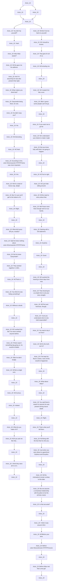

# Ionia/Aion/StateSec/Hyperion

```mermaid
graph TD
    15_0["Actor_10"]
    15_1["Actor_19: Was Atlas aware?"]
    15_2["Actor_19: You did it by yourself?"]
    15_3["Actor_10"]
    15_4["Actor_10: Yeah."]
    15_5["Actor_10: NCHe gave me his address."]
    15_6["Actor_10: And I'm assuming he was also present that night."]
    15_7["Actor_19: What makes you think that?"]
    15_8["Actor_10: Ganymede being there, for one."]
    15_9["Actor_19: He didn’t stop you?"]
    15_10["Actor_10: No."]
    15_11["Actor_19: NCInteresting."]
    15_12["Actor_10: NCYeah."]
    15_13["Actor_10: According to him, color=811e1eacolor=FFFFFFrteria was more important."]
    15_14["Actor_19: Hm."]
    15_15["Actor_10: NCIt’s a load of horse crap, alright."]
    15_16["Actor_10: But I’m sure we’ll get to the bottom of it."]
    15_17["Actor_19: Right."]
    15_18["Actor_19"]
    15_19["Actor_19: What did Icarus tell you, exactly?"]
    15_20["Actor_10: Said he knew nothing about color=811e1eacolor=FFFFFFrteria."]
    15_21["Actor_19: But he knew Ganymede?"]
    15_22["Actor_10: They worked together in 1921."]
    15_23["Actor_10: NCThat's it."]
    15_24["Actor_19: You think he was hiding something?"]
    15_25["Actor_10: Without a doubt."]
    15_26["Actor_10"]
    15_27["Actor_10: NCI worked him like I’ve never worked anyone before."]
    15_28["Actor_10: If there wasn’t something big going on, he would’ve folded."]
    15_29["Actor_10: SBut he didn’t budge."]
    15_30["Actor_10: SCNot a single inch."]
    15_31["Actor_10"]
    15_32["Actor_19: NCCurious."]
    15_33["Actor_10: Indeed."]
    15_34["Actor_10"]
    15_35["Actor_19: What do you make of it?"]
    15_36["Actor_10: NCIf you ask me like that..."]
    15_37["Actor_10: I think they were all in on it."]
    15_38["Actor_10"]
    15_39["Actor_19: NCDon’t be too hard on yourself."]
    15_40["Actor_10: SCI should’ve known."]
    15_41["Actor_19: That goes for all of us."]
    15_42["Actor_19: NCIncluding me."]
    15_43["Actor_19"]
    15_44["Actor_19: SCI treated him like a son."]
    15_45["Actor_19: SBut I guess some people can't let go."]
    15_46["Actor_19"]
    15_47["Actor_10: If you want me to go ba-"]
    15_48["Actor_19: NCI understand your desire to make it right."]
    15_49["Actor_19: But you know fully well that’s not going to happen."]
    15_50["Actor_19"]
    15_51["Actor_10: NCYou're right."]
    15_52["Actor_10: SCI just hate sitting around."]
    15_53["Actor_19: NCNo need to worry about that."]
    15_54["Actor_19: We’ll have more than enough work on our hands."]
    15_55["Actor_19"]
    15_56["Actor_19: Starting with a full statement."]
    15_57["Actor_10: Anytime."]
    15_58["Actor_19: Good."]
    15_59["Actor_19"]
    15_61["Actor_19: NCI pushed the hearing to three days from now."]
    15_62["Actor_19: That should give us ample time to set your story straight."]
    15_63["Actor_19: NCFirst and foremost, though..."]
    15_65["Actor_19: I trust you understand who’s to be held responsible?"]
    15_66["Actor_10: You want to lay it on Fero?"]
    15_67["Actor_19: NCIt's the truth, isn't it?"]
    15_68["Actor_19: If he kept his flock in check, none of this would’ve happened."]
    15_69["Actor_19"]
    15_70["Actor_10: What about Atlas?"]
    15_76["Actor_10: Is that accurate?"]
    15_77["Actor_19: I think it was around 1914."]
    15_78["Actor_19: NCBefore your time."]
    15_79["Actor_19: Before color=811e1eKcolor=FFFFFFenović."]
    15_80["Actor_19"]
    15_81["Actor_19: Before Atlas met that Lorna girl."]
    15_82["Actor_10"]
    15_83["Actor_10"]
    15_84["Actor_19"]
    15_85["Actor_10"]
    15_87["Actor_10"]
    15_88["Actor_19: You said there's reason to assume he was present during Icarus' death."]
    15_89["Actor_10: Right."]
    15_90["Actor_19: That's what you'll tell them."]
    15_91["Actor_19: NCAlong with the fact that he shot you."]
    15_92["Actor_19: Just when you were about to apprehend Orpheus and Eurydice."]
    15_93["Actor_19"]
    15_94["Actor_19: NCHis motivations remain unclear, to this date."]
    15_96["Actor_19: But we assume a romantical relationship with Eurydice to be the primary cause."]
    15_97["Actor_10"]
    15_0 --> 15_82
    15_0 --> 15_83
    15_1 --> 15_5
    15_2 --> 15_4
    15_3 --> 15_2
    15_3 --> 15_39
    15_4 --> 15_1
    15_5 --> 15_6
    15_6 --> 15_7
    15_7 --> 15_8
    15_8 --> 15_9
    15_9 --> 15_10
    15_10 --> 15_11
    15_11 --> 15_12
    15_12 --> 15_13
    15_13 --> 15_14
    15_14 --> 15_15
    15_15 --> 15_16
    15_16 --> 15_17
    15_17 --> 15_18
    15_18 --> 15_19
    15_19 --> 15_20
    15_20 --> 15_21
    15_21 --> 15_22
    15_22 --> 15_23
    15_23 --> 15_24
    15_24 --> 15_25
    15_25 --> 15_26
    15_26 --> 15_27
    15_27 --> 15_28
    15_28 --> 15_29
    15_29 --> 15_30
    15_30 --> 15_31
    15_31 --> 15_32
    15_32 --> 15_33
    15_33 --> 15_34
    15_34 --> 15_35
    15_35 --> 15_36
    15_36 --> 15_85
    15_37 --> 15_38
    15_39 --> 15_40
    15_40 --> 15_41
    15_41 --> 15_42
    15_42 --> 15_43
    15_43 --> 15_44
    15_44 --> 15_45
    15_45 --> 15_46
    15_46 --> 15_47
    15_47 --> 15_48
    15_48 --> 15_49
    15_49 --> 15_50
    15_50 --> 15_51
    15_51 --> 15_52
    15_52 --> 15_53
    15_53 --> 15_54
    15_54 --> 15_55
    15_55 --> 15_56
    15_56 --> 15_57
    15_57 --> 15_58
    15_58 --> 15_59
    15_59 --> 15_61
    15_61 --> 15_62
    15_62 --> 15_63
    15_63 --> 15_65
    15_65 --> 15_66
    15_66 --> 15_67
    15_67 --> 15_68
    15_68 --> 15_69
    15_69 --> 15_70
    15_70 --> 15_87
    15_76 --> 15_97
    15_77 --> 15_78
    15_78 --> 15_79
    15_79 --> 15_80
    15_80 --> 15_81
    15_81 --> 15_84
    15_82 --> 15_3
    15_83 --> 15_3
    15_85 --> 15_37
    15_87 --> 15_88
    15_88 --> 15_89
    15_89 --> 15_90
    15_90 --> 15_91
    15_91 --> 15_92
    15_92 --> 15_93
    15_93 --> 15_94
    15_94 --> 15_96
    15_96 --> 15_76
    15_97 --> 15_77
```