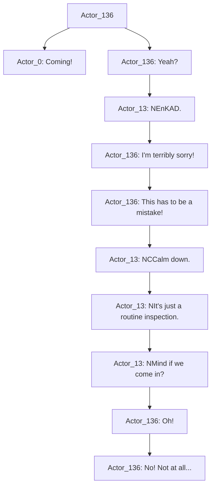

# Ionia/Kenovice/EV004

```mermaid
graph TD
    476_0["Actor_136"]
    476_1["Actor_0: Coming!"]
    476_2["Actor_136: Yeah?"]
    476_3["Actor_13: NEnKAD."]
    476_4["Actor_136: I'm terribly sorry!"]
    476_5["Actor_136: This has to be a mistake!"]
    476_6["Actor_13: NCCalm down."]
    476_7["Actor_13: NIt's just a routine inspection."]
    476_8["Actor_13: NMind if we come in?"]
    476_9["Actor_136: Oh!"]
    476_10["Actor_136: No! Not at all..."]
    476_0 --> 476_1
    476_0 --> 476_2
    476_2 --> 476_3
    476_3 --> 476_4
    476_4 --> 476_5
    476_5 --> 476_6
    476_6 --> 476_7
    476_7 --> 476_8
    476_8 --> 476_9
    476_9 --> 476_10
```