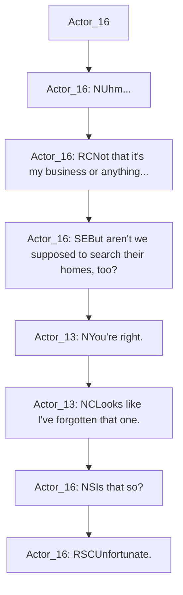

# Ionia/Kenovice/EV007

```mermaid
graph TD
    477_0["Actor_16"]
    477_1["Actor_16: NUhm..."]
    477_2["Actor_16: RCNot that it's my business or anything..."]
    477_3["Actor_16: SEBut aren't we supposed to search their homes, too?"]
    477_4["Actor_13: NYou're right."]
    477_5["Actor_13: NCLooks like I've forgotten that one."]
    477_6["Actor_16: NSIs that so?"]
    477_7["Actor_16: RSCUnfortunate."]
    477_0 --> 477_1
    477_1 --> 477_2
    477_2 --> 477_3
    477_3 --> 477_4
    477_4 --> 477_5
    477_5 --> 477_6
    477_6 --> 477_7
```