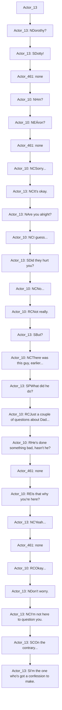

# Ionia/Kenovice/EnKAD Cell/Atlas

```mermaid
graph TD
    480_0["Actor_13"]
    480_1["Actor_13: NDorothy?"]
    480_2["Actor_13: SDotty!"]
    480_3["Actor_461: none"]
    480_4["Actor_10: NHm?"]
    480_5["Actor_10: NEÁron?"]
    480_6["Actor_461: none"]
    480_7["Actor_10: NCSorry..."]
    480_8["Actor_13: NCIt's okay."]
    480_9["Actor_13: NAre you alright?"]
    480_10["Actor_10: NCI guess..."]
    480_11["Actor_13: SDid they hurt you?"]
    480_12["Actor_10: NCNo..."]
    480_13["Actor_10: RCNot really."]
    480_14["Actor_13: SBut?"]
    480_15["Actor_10: NCThere was this guy, earlier..."]
    480_16["Actor_13: SPWhat did he do?"]
    480_17["Actor_10: RCJust a couple of questions about Dad..."]
    480_18["Actor_10: RHe's done something bad, hasn't he?"]
    480_19["Actor_461: none"]
    480_20["Actor_10: REIs that why you're here?"]
    480_21["Actor_13: NCYeah..."]
    480_22["Actor_461: none"]
    480_23["Actor_10: RCOkay..."]
    480_24["Actor_13: NDon't worry."]
    480_25["Actor_13: NCI'm not here to question you."]
    480_26["Actor_13: SCOn the contrary..."]
    480_27["Actor_13: SI'm the one who's got a confession to make."]
    480_0 --> 480_1
    480_1 --> 480_2
    480_2 --> 480_3
    480_3 --> 480_4
    480_4 --> 480_5
    480_5 --> 480_6
    480_6 --> 480_7
    480_7 --> 480_8
    480_8 --> 480_9
    480_9 --> 480_10
    480_10 --> 480_11
    480_11 --> 480_12
    480_12 --> 480_13
    480_13 --> 480_14
    480_14 --> 480_15
    480_15 --> 480_16
    480_16 --> 480_17
    480_17 --> 480_18
    480_18 --> 480_19
    480_19 --> 480_20
    480_20 --> 480_21
    480_21 --> 480_22
    480_22 --> 480_23
    480_23 --> 480_24
    480_24 --> 480_25
    480_25 --> 480_26
    480_26 --> 480_27
```