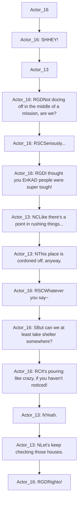

# Ionia/Kenovice/Intro (Kenovice)

```mermaid
graph TD
    478_0["Actor_16"]
    478_1["Actor_16: SHHEY!"]
    478_2["Actor_16: RGDNot dozing off in the middle of a mission, are we?"]
    478_3["Actor_16: RSCSeriously..."]
    478_4["Actor_13: NCLike there's a point in rushing things..."]
    478_5["Actor_13: NThis place is cordoned off, anyway."]
    478_6["Actor_16: RSCWhatever you say~"]
    478_7["Actor_16: SBut can we at least take shelter somewhere?"]
    478_8["Actor_16: RCIt's pouring like crazy, if you haven't noticed!"]
    478_9["Actor_13: NYeah."]
    478_10["Actor_13: NLet's keep checking those houses."]
    478_11["Actor_16: RGDRighto!"]
    478_13["Actor_16: RGDI thought you EnKAD people were super tough!"]
    478_14["Actor_13"]
    478_0 --> 478_1
    478_1 --> 478_14
    478_2 --> 478_3
    478_3 --> 478_13
    478_4 --> 478_5
    478_5 --> 478_6
    478_6 --> 478_7
    478_7 --> 478_8
    478_8 --> 478_9
    478_9 --> 478_10
    478_10 --> 478_11
    478_13 --> 478_4
    478_14 --> 478_2
```