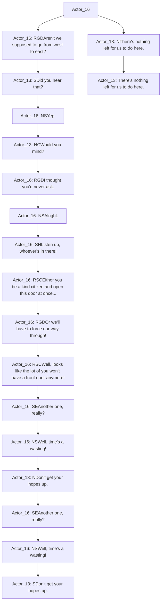

# Ionia/Kenovice/Preston Door

```mermaid
graph TD
    357_0["Actor_16"]
    357_1["Actor_16: RGDAren't we supposed to go from west to east?"]
    357_2["Actor_13: SDid you hear that?"]
    357_3["Actor_16: NSYep."]
    357_4["Actor_13: NCWould you mind?"]
    357_5["Actor_16: RGDI thought you'd never ask."]
    357_6["Actor_16: NSAlright."]
    357_7["Actor_16: SHListen up, whoever's in there!"]
    357_8["Actor_16: RSCEither you be a kind citizen and open this door at once..."]
    357_9["Actor_16: RGDOr we'll have to force our way through!"]
    357_10["Actor_16: RSCWell, looks like the lot of you won't have a front door anymore!"]
    357_11["Actor_16: SEAnother one, really?"]
    357_12["Actor_16: NSWell, time's a wasting!"]
    357_13["Actor_13: NDon't get your hopes up."]
    357_14["Actor_16: SEAnother one, really?"]
    357_15["Actor_16: NSWell, time's a wasting!"]
    357_16["Actor_13: SDon't get your hopes up."]
    357_17["Actor_13: NThere's nothing left for us to do here."]
    357_18["Actor_13: There's nothing left for us to do here."]
    357_0 --> 357_1
    357_0 --> 357_17
    357_1 --> 357_2
    357_2 --> 357_3
    357_3 --> 357_4
    357_4 --> 357_5
    357_5 --> 357_6
    357_6 --> 357_7
    357_7 --> 357_8
    357_8 --> 357_9
    357_9 --> 357_10
    357_10 --> 357_11
    357_11 --> 357_12
    357_12 --> 357_13
    357_13 --> 357_14
    357_14 --> 357_15
    357_15 --> 357_16
    357_17 --> 357_18
```