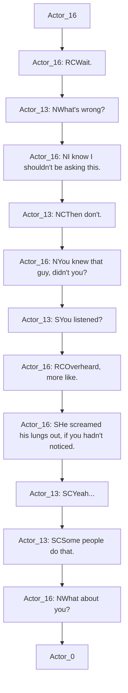

# Ionia/Kenovice/Preston House/EV002

```mermaid
graph TD
    483_0["Actor_16"]
    483_1["Actor_16: RCWait."]
    483_2["Actor_13: NWhat's wrong?"]
    483_3["Actor_16: NI know I shouldn't be asking this."]
    483_4["Actor_13: NCThen don't."]
    483_5["Actor_16: NYou knew that guy, didn't you?"]
    483_6["Actor_13: SYou listened?"]
    483_7["Actor_16: RCOverheard, more like."]
    483_8["Actor_16: SHe screamed his lungs out, if you hadn't noticed."]
    483_9["Actor_13: SCYeah..."]
    483_10["Actor_13: SCSome people do that."]
    483_11["Actor_16: NWhat about you?"]
    483_12["Actor_0"]
    483_0 --> 483_1
    483_1 --> 483_2
    483_2 --> 483_3
    483_3 --> 483_4
    483_4 --> 483_5
    483_5 --> 483_6
    483_6 --> 483_7
    483_7 --> 483_8
    483_8 --> 483_9
    483_9 --> 483_10
    483_10 --> 483_11
    483_11 --> 483_12
```