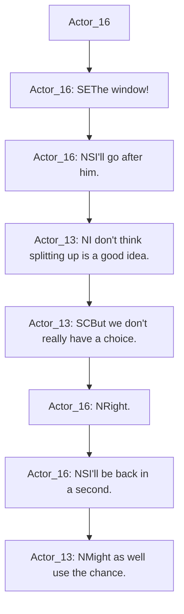

# Ionia/Kenovice/Preston House/First level/EV001

```mermaid
graph TD
    484_0["Actor_16"]
    484_1["Actor_16: SEThe window!"]
    484_2["Actor_16: NSI'll go after him."]
    484_3["Actor_13: NI don't think splitting up is a good idea."]
    484_4["Actor_13: SCBut we don't really have a choice."]
    484_5["Actor_16: NRight."]
    484_6["Actor_16: NSI'll be back in a second."]
    484_7["Actor_13: NMight as well use the chance."]
    484_0 --> 484_1
    484_1 --> 484_2
    484_2 --> 484_3
    484_3 --> 484_4
    484_4 --> 484_5
    484_5 --> 484_6
    484_6 --> 484_7
```