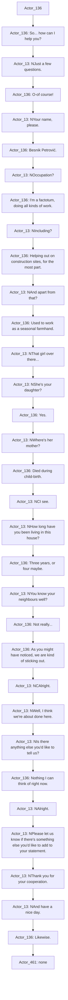

# Ionia/Kenovice/Shack/EV002

```mermaid
graph TD
    486_0["Actor_136"]
    486_1["Actor_136: So... how can I help you?"]
    486_2["Actor_13: NJust a few questions."]
    486_3["Actor_136: O-of course!"]
    486_4["Actor_13: NYour name, please."]
    486_5["Actor_136: Besnik Petrović."]
    486_6["Actor_13: NOccupation?"]
    486_7["Actor_136: I'm a factotum, doing all kinds of work."]
    486_8["Actor_13: NIncluding?"]
    486_9["Actor_136: Helping out on construction sites, for the most part."]
    486_10["Actor_13: NAnd apart from that?"]
    486_11["Actor_136: Used to work as a seasonal farmhand."]
    486_12["Actor_13: NThat girl over there..."]
    486_13["Actor_13: NShe's your daughter?"]
    486_14["Actor_136: Yes."]
    486_15["Actor_13: NWhere's her mother?"]
    486_16["Actor_136: Died during child-birth."]
    486_17["Actor_13: NCI see."]
    486_18["Actor_13: NHow long have you been living in this house?"]
    486_19["Actor_136: Three years, or four maybe."]
    486_20["Actor_13: NYou know your neighbours well?"]
    486_21["Actor_136: Not really..."]
    486_22["Actor_136: As you might have noticed, we are kind of sticking out."]
    486_23["Actor_13: NCAlright."]
    486_24["Actor_13: NWell, I think we're about done here."]
    486_25["Actor_13: NIs there anything else you'd like to tell us?"]
    486_26["Actor_136: Nothing I can think of right now."]
    486_27["Actor_13: NAlright."]
    486_28["Actor_13: NPlease let us know if there's something else you'd like to add to your statement."]
    486_29["Actor_13: NThank you for your cooperation."]
    486_30["Actor_13: NAnd have a nice day."]
    486_31["Actor_136: Likewise."]
    486_32["Actor_461: none"]
    486_0 --> 486_1
    486_1 --> 486_2
    486_2 --> 486_3
    486_3 --> 486_4
    486_4 --> 486_5
    486_5 --> 486_6
    486_6 --> 486_7
    486_7 --> 486_8
    486_8 --> 486_9
    486_9 --> 486_10
    486_10 --> 486_11
    486_11 --> 486_12
    486_12 --> 486_13
    486_13 --> 486_14
    486_14 --> 486_15
    486_15 --> 486_16
    486_16 --> 486_17
    486_17 --> 486_18
    486_18 --> 486_19
    486_19 --> 486_20
    486_20 --> 486_21
    486_21 --> 486_22
    486_22 --> 486_23
    486_23 --> 486_24
    486_24 --> 486_25
    486_25 --> 486_26
    486_26 --> 486_27
    486_27 --> 486_28
    486_28 --> 486_29
    486_29 --> 486_30
    486_30 --> 486_31
    486_31 --> 486_32
```