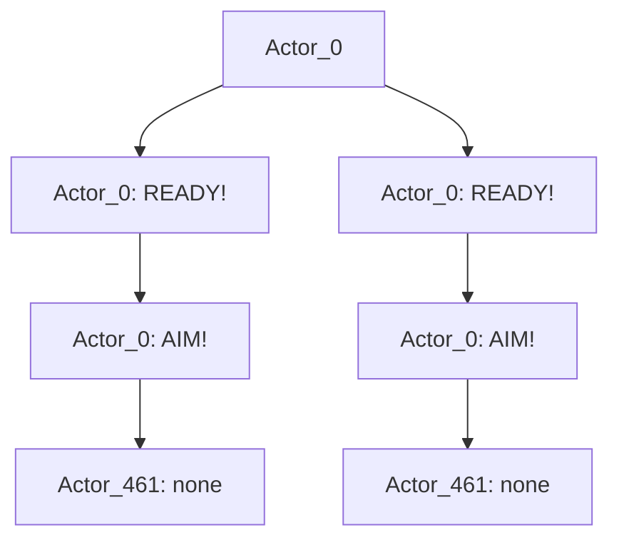

# Ionia/Thwarton Fields/EV006

```mermaid
graph TD
    487_0["Actor_0"]
    487_1["Actor_0: READY!"]
    487_2["Actor_0: AIM!"]
    487_3["Actor_461: none"]
    487_4["Actor_0: READY!"]
    487_5["Actor_0: AIM!"]
    487_6["Actor_461: none"]
    487_0 --> 487_1
    487_0 --> 487_4
    487_1 --> 487_2
    487_2 --> 487_3
    487_4 --> 487_5
    487_5 --> 487_6
```