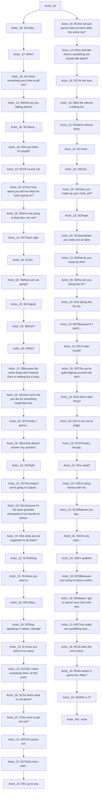

# Ionia/Train/EV001

```mermaid
graph TD
    488_0["Actor_16"]
    488_1["Actor_16: SCAtlas..."]
    488_2["Actor_13: NHm?"]
    488_3["Actor_16: SIs there something you'd like to tell me?"]
    488_4["Actor_13: NWhat are you talking about?"]
    488_5["Actor_16: SCJesus..."]
    488_6["Actor_16: SDo you think I'm stupid?"]
    488_7["Actor_13: NCOf course not."]
    488_8["Actor_16: SThen how about you tell me what the fuck's going on?"]
    488_9["Actor_16: SWe're not going to that dam, are we?"]
    488_10["Actor_13: NCThat's right."]
    488_11["Actor_16: SCSo..."]
    488_12["Actor_16: SWhere are we going?"]
    488_13["Actor_13: SCCalpoli."]
    488_14["Actor_16: SEHuh?"]
    488_15["Actor_16: SWhy?"]
    488_16["Actor_13: SBecause the entire thing with Fredrick Dam is nothing but a hoax."]
    488_17["Actor_13: SCAnd I won't let you die for something stupid like that."]
    488_18["Actor_16: SCThanks, I guess..."]
    488_19["Actor_16: SBut that doesn't answer my question."]
    488_20["Actor_13: SCRight."]
    488_21["Actor_13: SCThe reason we're going to Calpoli..."]
    488_22["Actor_13: SIs because it's the least guarded checkpoint of our border to Amryn."]
    488_23["Actor_16: SSo what are we supposed to do there?"]
    488_24["Actor_13: SCNothing."]
    488_25["Actor_13: SUnless you want to."]
    488_26["Actor_16: SPCAtlas..."]
    488_27["Actor_16: SPStop speaking in riddles, already!"]
    488_28["Actor_13: SI know you want to run away."]
    488_29["Actor_13: SCHell, I think everybody does, at this point."]
    488_30["Actor_16: SCSo that's what it's all about?"]
    488_31["Actor_16: SYou want to get me out?"]
    488_32["Actor_13: SPCOf course not."]
    488_33["Actor_13: SCThat's why I said..."]
    488_34["Actor_13: SIt's up to you."]
    488_35["Actor_16: RCAre we just gonna stare at each other the entire trip?"]
    488_36["Actor_13: NYou feel like there's something we should talk about?"]
    488_37["Actor_16: SCI'm not sure."]
    488_38["Actor_16: SBut the silence is killing me."]
    488_39["Actor_13: NCWe're almost there."]
    488_40["Actor_16: RCYeah..."]
    488_41["Actor_16: SSCSo..."]
    488_42["Actor_16: SSHave you made up your mind, yet?"]
    488_43["Actor_13: SCNope."]
    488_44["Actor_16: SCSometimes you really are an idiot."]
    488_45["Actor_13: SWhat do you mean by that?"]
    488_46["Actor_16: SWho are you doing this for?"]
    488_47["Actor_13: SI'm doing this for me."]
    488_48["Actor_13: SPCBecause if I didn't..."]
    488_49["Actor_13: SPI'd hate myself."]
    488_50["Actor_16: SPCSo you're guilt-tripping yourself into this?"]
    488_51["Actor_13: NCIs that a bad thing?"]
    488_52["Actor_16: SCI'm not one to judge."]
    488_53["Actor_16: RCSThanks, though."]
    488_54["Actor_13: SFor what?"]
    488_55["Actor_16: SSFor being honest with me."]
    488_56["Actor_13: SCWhatever you say..."]
    488_57["Actor_16: SSCIn any case..."]
    488_58["Actor_16: SSI'm grateful."]
    488_59["Actor_16: RCSBecause you trying to prove a point..."]
    488_60["Actor_16: SSMeans I get to spend more time with you."]
    488_61["Actor_13: NPCYou really are something else..."]
    488_62["Actor_16: RCSLooks like we're there."]
    488_63["Actor_16: RSSo what's it gonna be, Atlas?"]
    488_64["Actor_16: SEWho is it?"]
    488_65["Actor_461: none"]
    488_0 --> 488_1
    488_0 --> 488_35
    488_1 --> 488_2
    488_2 --> 488_3
    488_3 --> 488_4
    488_4 --> 488_5
    488_5 --> 488_6
    488_6 --> 488_7
    488_7 --> 488_8
    488_8 --> 488_9
    488_9 --> 488_10
    488_10 --> 488_11
    488_11 --> 488_12
    488_12 --> 488_13
    488_13 --> 488_14
    488_14 --> 488_15
    488_15 --> 488_16
    488_16 --> 488_17
    488_17 --> 488_18
    488_18 --> 488_19
    488_19 --> 488_20
    488_20 --> 488_21
    488_21 --> 488_22
    488_22 --> 488_23
    488_23 --> 488_24
    488_24 --> 488_25
    488_25 --> 488_26
    488_26 --> 488_27
    488_27 --> 488_28
    488_28 --> 488_29
    488_29 --> 488_30
    488_30 --> 488_31
    488_31 --> 488_32
    488_32 --> 488_33
    488_33 --> 488_34
    488_35 --> 488_36
    488_36 --> 488_37
    488_37 --> 488_38
    488_38 --> 488_39
    488_39 --> 488_40
    488_40 --> 488_41
    488_41 --> 488_42
    488_42 --> 488_43
    488_43 --> 488_44
    488_44 --> 488_45
    488_45 --> 488_46
    488_46 --> 488_47
    488_47 --> 488_48
    488_48 --> 488_49
    488_49 --> 488_50
    488_50 --> 488_51
    488_51 --> 488_52
    488_52 --> 488_53
    488_53 --> 488_54
    488_54 --> 488_55
    488_55 --> 488_56
    488_56 --> 488_57
    488_57 --> 488_58
    488_58 --> 488_59
    488_59 --> 488_60
    488_60 --> 488_61
    488_61 --> 488_62
    488_62 --> 488_63
    488_63 --> 488_64
    488_64 --> 488_65
```