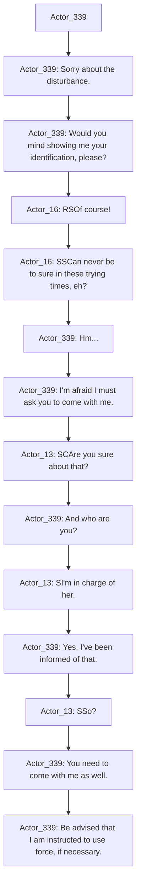

# Ionia/Train/EV002

```mermaid
graph TD
    489_0["Actor_339"]
    489_1["Actor_339: Sorry about the disturbance."]
    489_2["Actor_339: Would you mind showing me your identification, please?"]
    489_3["Actor_16: RSOf course!"]
    489_4["Actor_16: SSCan never be to sure in these trying times, eh?"]
    489_5["Actor_339: Hm..."]
    489_6["Actor_339: I'm afraid I must ask you to come with me."]
    489_7["Actor_13: SCAre you sure about that?"]
    489_8["Actor_339: And who are you?"]
    489_9["Actor_13: SI'm in charge of her."]
    489_10["Actor_339: Yes, I've been informed of that."]
    489_11["Actor_13: SSo?"]
    489_12["Actor_339: You need to come with me as well."]
    489_13["Actor_339: Be advised that I am instructed to use force, if necessary."]
    489_0 --> 489_1
    489_1 --> 489_2
    489_2 --> 489_3
    489_3 --> 489_4
    489_4 --> 489_5
    489_5 --> 489_6
    489_6 --> 489_7
    489_7 --> 489_8
    489_8 --> 489_9
    489_9 --> 489_10
    489_10 --> 489_11
    489_11 --> 489_12
    489_12 --> 489_13
```