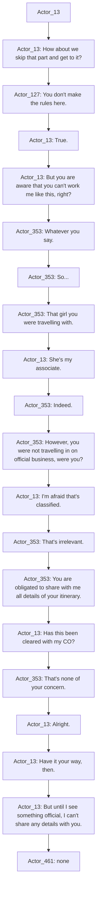

# Ionia/Train/Lorna Shakeup/EV001

```mermaid
graph TD
    490_0["Actor_13"]
    490_1["Actor_13: How about we skip that part and get to it?"]
    490_2["Actor_127: You don't make the rules here."]
    490_3["Actor_13: True."]
    490_4["Actor_13: But you are aware that you can't work me like this, right?"]
    490_5["Actor_353: Whatever you say."]
    490_6["Actor_353: So..."]
    490_7["Actor_353: That girl you were travelling with."]
    490_8["Actor_13: She's my associate."]
    490_9["Actor_353: Indeed."]
    490_10["Actor_353: However, you were not travelling in on official business, were you?"]
    490_11["Actor_13: I'm afraid that's classified."]
    490_12["Actor_353: That's irrelevant."]
    490_13["Actor_353: You are obligated to share with me all details of your itinerary."]
    490_14["Actor_13: Has this been cleared with my CO?"]
    490_15["Actor_353: That's none of your concern."]
    490_16["Actor_13: Alright."]
    490_17["Actor_13: Have it your way, then."]
    490_18["Actor_13: But until I see something official, I can't share any details with you."]
    490_19["Actor_461: none"]
    490_0 --> 490_1
    490_1 --> 490_2
    490_2 --> 490_3
    490_3 --> 490_4
    490_4 --> 490_5
    490_5 --> 490_6
    490_6 --> 490_7
    490_7 --> 490_8
    490_8 --> 490_9
    490_9 --> 490_10
    490_10 --> 490_11
    490_11 --> 490_12
    490_12 --> 490_13
    490_13 --> 490_14
    490_14 --> 490_15
    490_15 --> 490_16
    490_16 --> 490_17
    490_17 --> 490_18
    490_18 --> 490_19
```