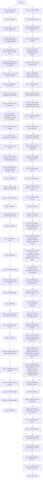

# Ionia/Train/Lorna Shakeup/EV004

```mermaid
graph TD
    491_0["Actor_19"]
    491_1["Actor_19: NCI'm afraid that's impossible."]
    491_2["Actor_16: SCWhy?"]
    491_3["Actor_16: SAren't you his boss or something?"]
    491_4["Actor_19: NCYou do understand the gravity of this situation, do you?"]
    491_5["Actor_19: NCDesertion is a crime handled by military courts."]
    491_6["Actor_19: NCIf it comes to light that he helped you in your attempt."]
    491_7["Actor_19: NHe won't be the only one in trouble."]
    491_8["Actor_16: SWhat do you mean by that?"]
    491_9["Actor_19: NCYour sister knew about this operation."]
    491_10["Actor_19: NCAnd as much as it pains me..."]
    491_11["Actor_19: NThere is substantial evidence proving that she was the one who leaked it."]
    491_12["Actor_16: SPCNow hold on a minute."]
    491_13["Actor_16: SPAre you saying that she sold us out?"]
    491_14["Actor_19: NCIt's only a theory."]
    491_15["Actor_19: NYou can be sure that I will take a deep look into this matter."]
    491_16["Actor_19: NCBut first, we need to deal with the situation at hand."]
    491_17["Actor_16: SCRight."]
    491_18["Actor_19: NDid you tell anybody else about this?"]
    491_19["Actor_16: SI don't think so."]
    491_20["Actor_16: SWait..."]
    491_21["Actor_16: SI think I said something to Dorothy."]
    491_22["Actor_16: SCSorry."]
    491_23["Actor_16: SDaphne, I mean."]
    491_24["Actor_19: NCI see."]
    491_25["Actor_19: NPCThis is bad."]
    491_26["Actor_16: SIs she gonna get in trouble because of that?"]
    491_27["Actor_19: NPCVery likely."]
    491_28["Actor_16: RCShit."]
    491_29["Actor_16: SCThere's got to be something we can do."]
    491_30["Actor_19: NCThere might be a way."]
    491_31["Actor_16: SYeah?"]
    491_32["Actor_19: NPCI really don't want to put this on you."]
    491_33["Actor_16: RCWell, you said it yourself."]
    491_34["Actor_16: SCIf we don't do anything..."]
    491_35["Actor_16: SWe're fucked."]
    491_36["Actor_16: SCSo go ahead..."]
    491_37["Actor_16: STell me."]
    491_38["Actor_13: SYou're kidding me."]
    491_39["Actor_19: NI wish I was."]
    491_40["Actor_19: NCBut I'm afraid the situation is far too dire for that."]
    491_41["Actor_13: SPWhat did you do to her?"]
    491_42["Actor_19: NCI merely explained to her the ramifications of this incident."]
    491_43["Actor_19: NOn each and everyone of us."]
    491_44["Actor_13: SPCDid you mention that the entire thing was your idea, too?"]
    491_45["Actor_19: SCOf course I didn't."]
    491_46["Actor_19: SBut if you want, I'll go and tell her right now."]
    491_47["Actor_19: SI'm sure the interrogators would love to get that out of her, as well."]
    491_48["Actor_13: SPLet me speak to her, then."]
    491_49["Actor_19: SCYou know that's impossible."]
    491_50["Actor_19: SCI already took a huge risk coming here."]
    491_51["Actor_19: SThere's no way I'll let you endanger everything."]
    491_52["Actor_13: SPCAlways looking out for yourself, aren't you?"]
    491_53["Actor_19: SCIt's for your sake, too."]
    491_54["Actor_19: SAnd Eury's."]
    491_55["Actor_19: SCAll of us are implied in a serious breach of protocol."]
    491_56["Actor_19: SCSome might even say..."]
    491_57["Actor_19: STreason."]
    491_58["Actor_19: NCWhich is ridiculous, of course."]
    491_59["Actor_19: NYou were merely investigating a case of attempted desertion within the military."]
    491_60["Actor_19: NPCThe person in question being a Corporal named Lorna Faragó, born on the 5th May, 1897."]
    491_61["Actor_19: NTo confirm your suspicions, you accompanied said Corporal all the way to the checkpoint near the city of Calpoli."]
    491_62["Actor_19: NPCYour investigation was interrupted by two officials of the military."]
    491_63["Actor_19: NPObviously they were not aware of your intentions."]
    491_64["Actor_19: NCSo they apprehended both you and Lorna."]
    491_65["Actor_19: NPCIn the course of being questioned..."]
    491_66["Actor_19: NPLorna revealed that she, in fact, intended to desert."]
    491_67["Actor_19: NPCSo, even though the military acted too rashly..."]
    491_68["Actor_19: NPThey are to be commended on their efforts of keeping their own troops in line."]
    491_69["Actor_19: NPCAs a member of EnKAD, I am deeply troubled by the sheer audacity to abandon Ionia in such a cowardly fashion."]
    491_70["Actor_19: NPCHowever, I also personally believe that this incident can and should be used as an appeal to further consolidate the executive branches of Ionia."]
    491_71["Actor_19: NPIs that agreeable to you?"]
    491_72["Actor_19: SCAtlas..."]
    491_73["Actor_19: SShe is dead, no matter what."]
    491_74["Actor_19: SCThere's nothing either of us can do to change that."]
    491_75["Actor_19: NPCWe took a chance..."]
    491_76["Actor_19: NPAnd we lost."]
    491_77["Actor_19: SLorna is willing to take the fall for us."]
    491_78["Actor_19: SCAnd I know you would do the same for her."]
    491_79["Actor_19: SPCSo please, I implore you..."]
    491_80["Actor_19: SPDon't let her sacrifice go in vain."]
    491_81["Actor_461: none"]
    491_0 --> 491_1
    491_0 --> 491_38
    491_1 --> 491_2
    491_2 --> 491_3
    491_3 --> 491_4
    491_4 --> 491_5
    491_5 --> 491_6
    491_6 --> 491_7
    491_7 --> 491_8
    491_8 --> 491_9
    491_9 --> 491_10
    491_10 --> 491_11
    491_11 --> 491_12
    491_12 --> 491_13
    491_13 --> 491_14
    491_14 --> 491_15
    491_15 --> 491_16
    491_16 --> 491_17
    491_17 --> 491_18
    491_18 --> 491_19
    491_19 --> 491_20
    491_20 --> 491_21
    491_21 --> 491_22
    491_22 --> 491_23
    491_23 --> 491_24
    491_24 --> 491_25
    491_25 --> 491_26
    491_26 --> 491_27
    491_27 --> 491_28
    491_28 --> 491_29
    491_29 --> 491_30
    491_30 --> 491_31
    491_31 --> 491_32
    491_32 --> 491_33
    491_33 --> 491_34
    491_34 --> 491_35
    491_35 --> 491_36
    491_36 --> 491_37
    491_38 --> 491_39
    491_39 --> 491_40
    491_40 --> 491_41
    491_41 --> 491_42
    491_42 --> 491_43
    491_43 --> 491_44
    491_44 --> 491_45
    491_45 --> 491_46
    491_46 --> 491_47
    491_47 --> 491_48
    491_48 --> 491_49
    491_49 --> 491_50
    491_50 --> 491_51
    491_51 --> 491_52
    491_52 --> 491_53
    491_53 --> 491_54
    491_54 --> 491_55
    491_55 --> 491_56
    491_56 --> 491_57
    491_57 --> 491_58
    491_58 --> 491_59
    491_59 --> 491_60
    491_60 --> 491_61
    491_61 --> 491_62
    491_62 --> 491_63
    491_63 --> 491_64
    491_64 --> 491_65
    491_65 --> 491_66
    491_66 --> 491_67
    491_67 --> 491_68
    491_68 --> 491_69
    491_69 --> 491_70
    491_70 --> 491_71
    491_71 --> 491_72
    491_72 --> 491_73
    491_73 --> 491_74
    491_74 --> 491_75
    491_75 --> 491_76
    491_76 --> 491_77
    491_77 --> 491_78
    491_78 --> 491_79
    491_79 --> 491_80
    491_80 --> 491_81
```