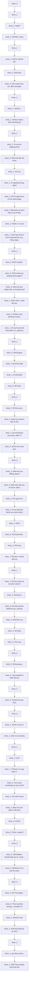

# Ionia/Wenger Sanatorium/East/E1

```mermaid
graph TD
    6_0["Actor_2"]
    6_1["Actor_2"]
    6_2["Actor_1: Daph?"]
    6_3["Actor_2: NSHello, Gany."]
    6_4["Actor_1: NSI've missed you."]
    6_5["Actor_2: NSCAww."]
    6_6["Actor_2: NSI missed you too, little honeypie."]
    6_7["Actor_2"]
    6_8["Actor_1: NSCSo..."]
    6_9["Actor_1: NSYou wanna start catching up?"]
    6_10["Actor_1: Or are we skipping that?"]
    6_11["Actor_2: NSCJust like old times."]
    6_12["Actor_1: NCYup."]
    6_13["Actor_1: It's getting boring, right?"]
    6_15["Actor_2: NCI'm glad we're on the same page."]
    6_16["Actor_2: Because we don't have a lot of time."]
    6_17["Actor_1: RGOh, I'm sure!"]
    6_18["Actor_1: RGCI bet there's a lot of demand for you, these days."]
    6_19["Actor_1"]
    6_20["Actor_2: NSCI wonder..."]
    6_21["Actor_2: NGCIs that you playing dumb again?"]
    6_22["Actor_2: NGOr do you really have no fucking clue?"]
    6_23["Actor_1: NSCI wish I could tell you."]
    6_24["Actor_1: RCBut to be perfectly honest..."]
    6_25["Actor_1: RI can't even tell what date it is, anymore."]
    6_26["Actor_1"]
    6_27["Actor_2: NSCAugust."]
    6_28["Actor_2: NSCThe 28th."]
    6_29["Actor_1: RCAlready?"]
    6_30["Actor_2: NCYeah."]
    6_31["Actor_2: SCOne year..."]
    6_32["Actor_2: SAnd you haven't told us shit."]
    6_34["Actor_1: pic=6I backed your story, didn't I?"]
    6_35["Actor_2: NCFor the most part."]
    6_37["Actor_1: What are you talking about?"]
    6_38["Actor_2: Atlas was with you at Icarus' place."]
    6_39["Actor_1: NCI guess so."]
    6_40["Actor_2: SYou told your doctor you were alone."]
    6_41["Actor_1: RSo?"]
    6_42["Actor_2: SCGanymede..."]
    6_43["Actor_1: RCSorry."]
    6_44["Actor_1: RGuess I mixed that up."]
    6_45["Actor_1"]
    6_46["Actor_1: RCYou want me to write it down?"]
    6_47["Actor_2: NCSave it."]
    6_48["Actor_2: Not like anyone believes you, anyway."]
    6_49["Actor_1: NSCPoor me."]
    6_50["Actor_2: NCYeah."]
    6_51["Actor_2: Poor you."]
    6_52["Actor_2"]
    6_53["Actor_2: NCAnyways..."]
    6_54["Actor_2: I just wanted to clear that up."]
    6_55["Actor_2"]
    6_56["Actor_2: Thanks for your time."]
    6_57["Actor_2"]
    6_58["Actor_1: SCOh come on."]
    6_59["Actor_1: SCut it out already."]
    6_60["Actor_1"]
    6_61["Actor_2: Hm?"]
    6_62["Actor_1: SThere's no way that's it."]
    6_63["Actor_2: You've got something on your mind?"]
    6_64["Actor_1: SCI don't know."]
    6_65["Actor_1: SBut we can't leave it like that."]
    6_66["Actor_2: NCHm."]
    6_67["Actor_2: Sorry, I guess?"]
    6_68["Actor_2"]
    6_69["Actor_2: NSCMaybe I should beat you to a pulp..."]
    6_70["Actor_2: NSCEven if it's just for show."]
    6_71["Actor_2"]
    6_72["Actor_2: NCThen again..."]
    6_73["Actor_2: That would be boring,\,\, wouldn't it?\n"]
    6_74["Actor_1: NSCOh wow."]
    6_75["Actor_1: RAll that build-up, for this?"]
    6_76["Actor_1: pic=6You know..."]
    6_77["Actor_1: NSCThey already tried that shit-"]
    6_78["Actor_1"]
    6_79["Actor_1"]
    6_80["Actor_1"]
    6_81["Actor_2"]
    6_82["Actor_2"]
    6_0 --> 6_1
    6_1 --> 6_2
    6_2 --> 6_3
    6_3 --> 6_79
    6_4 --> 6_5
    6_5 --> 6_6
    6_6 --> 6_7
    6_7 --> 6_8
    6_8 --> 6_9
    6_9 --> 6_78
    6_10 --> 6_11
    6_11 --> 6_12
    6_12 --> 6_13
    6_13 --> 6_15
    6_15 --> 6_16
    6_16 --> 6_17
    6_17 --> 6_18
    6_18 --> 6_19
    6_19 --> 6_20
    6_20 --> 6_21
    6_21 --> 6_22
    6_22 --> 6_23
    6_23 --> 6_24
    6_24 --> 6_25
    6_25 --> 6_26
    6_26 --> 6_27
    6_27 --> 6_28
    6_28 --> 6_29
    6_29 --> 6_30
    6_30 --> 6_82
    6_31 --> 6_32
    6_32 --> 6_34
    6_34 --> 6_35
    6_35 --> 6_81
    6_37 --> 6_38
    6_38 --> 6_39
    6_39 --> 6_40
    6_40 --> 6_41
    6_41 --> 6_42
    6_42 --> 6_43
    6_43 --> 6_44
    6_44 --> 6_45
    6_45 --> 6_46
    6_46 --> 6_47
    6_47 --> 6_48
    6_48 --> 6_49
    6_49 --> 6_50
    6_50 --> 6_51
    6_51 --> 6_52
    6_52 --> 6_53
    6_53 --> 6_54
    6_54 --> 6_55
    6_55 --> 6_56
    6_56 --> 6_57
    6_57 --> 6_58
    6_58 --> 6_59
    6_59 --> 6_60
    6_60 --> 6_61
    6_61 --> 6_62
    6_62 --> 6_63
    6_63 --> 6_64
    6_64 --> 6_65
    6_65 --> 6_66
    6_66 --> 6_67
    6_67 --> 6_68
    6_68 --> 6_69
    6_69 --> 6_70
    6_70 --> 6_71
    6_71 --> 6_72
    6_72 --> 6_73
    6_73 --> 6_74
    6_74 --> 6_75
    6_75 --> 6_80
    6_76 --> 6_77
    6_78 --> 6_10
    6_79 --> 6_4
    6_80 --> 6_76
    6_81 --> 6_37
    6_82 --> 6_31
```