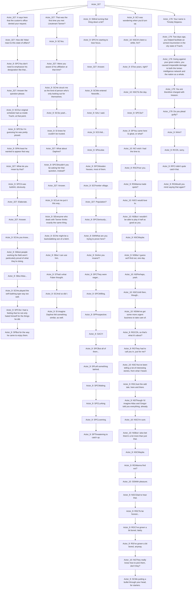

# Ionia/Wenger Sanatorium/East/E2

```mermaid
graph TD
    496_0["Actor_327"]
    496_1["Actor_327: It says here that the custom's office denied your request."]
    496_2["Actor_327: How did 'Atlas' react to this state of affairs?"]
    496_3["Actor_9: SPCYou don't need to emphasize his designation like that..."]
    496_4["Actor_327: Answer the question please."]
    496_5["Actor_9: SCOur original schedule had us inside Trachi, at that point."]
    496_6["Actor_9: SPCSo I'm guessing he was pretty pissed."]
    496_7["Actor_9: SPAt least he wanted to appear that way."]
    496_8["Actor_327: What do you mean by that?"]
    496_9["Actor_9: SPCIt was bullshit, obviously."]
    496_10["Actor_327: Elaborate."]
    496_11["Actor_327: Answer."]
    496_12["Actor_9: SCAs you know..."]
    496_13["Actor_9: SMost people working the field aren't particularly proud of what they're doing."]
    496_14["Actor_9: SBut Atlas..."]
    496_15["Actor_9: SCHe played the self-loathing type way too well."]
    496_16["Actor_9: SPCSo I had a feeling that he not only hated himself for the things he did."]
    496_17["Actor_9: SPBut for the way he came to enjoy them."]
    496_18["Actor_327: That was the first time you met Lieutenant Tanner?"]
    496_19["Actor_9: SCYes."]
    496_20["Actor_327: Were you aware of his affiliation at that time?"]
    496_21["Actor_9: SCHe struck me as the kind of person who's only looking out for themselves."]
    496_22["Actor_9: SCSo yeah..."]
    496_23["Actor_9: SI knew he couldn't be trusted."]
    496_24["Actor_327: What about Daphne?"]
    496_25["Actor_9: SPCShouldn't you be asking her that question, instead?"]
    496_26["Actor_327: Answer."]
    496_27["Actor_9: SCLet me put it this way..."]
    496_28["Actor_9: SEveryone who deals with Tanner thinks exactly the same thing."]
    496_29["Actor_9: SCHe might be a backstabbing son of a bitch."]
    496_30["Actor_9: SBut I can use him."]
    496_31["Actor_9: SThat's what Faber thought."]
    496_32["Actor_9: SCAnd so did I."]
    496_33["Actor_9: SI imagine Daphne felt something similar, as well."]
    496_34["Actor_9: SMind turning that thing down a bit?"]
    496_35["Actor_9: SPCI'm starting to lose focus."]
    496_36["Actor_327: Answer."]
    496_37["Actor_9: SCWe entered Nestville..."]
    496_38["Actor_9: SAs I said."]
    496_39["Actor_9: SCIt felt..."]
    496_40["Actor_9: SPeculiar."]
    496_41["Actor_9: SPCWooden houses, most of them."]
    496_42["Actor_9: SCFrontier village."]
    496_43["Actor_327: Population?"]
    496_44["Actor_9: SPCSeriously..."]
    496_45["Actor_9: SWWhat are you trying to prove here?"]
    496_46["Actor_9: SAAre you insane?!"]
    496_47["Actor_9: SPCThey were eager..."]
    496_48["Actor_9: SPCWilling."]
    496_49["Actor_9: SPProspective."]
    496_50["Actor_9: SAC!!!"]
    496_51["Actor_9: SPCBut all of them..."]
    496_52["Actor_9: SPLeft something behind."]
    496_53["Actor_9: SPCWaiting."]
    496_54["Actor_9: SPCLurking."]
    496_55["Actor_9: SPCLooming."]
    496_56["Actor_9: SPThreatening to catch up."]
    496_57["Actor_9: SCI was wondering when you'd turn up."]
    496_58["Actor_10: NSCIt's been a while, hm?"]
    496_59["Actor_9: STwo years, right?"]
    496_60["Actor_10: NSCTo the day."]
    496_61["Actor_9: SPCSo?"]
    496_62["Actor_9: SPYou came here to gloat, or what?"]
    496_63["Actor_10: NCI wish I had the time to."]
    496_64["Actor_9: RSCPoor you."]
    496_65["Actor_9: RSWanna trade spots?"]
    496_66["Actor_10: NSCI would love to."]
    496_67["Actor_10: NSBut I wouldn't be able to play it half as good as you."]
    496_68["Actor_9: NSCMaybe."]
    496_69["Actor_9: NSBut I guess we'll find out, one day."]
    496_70["Actor_10: NSPerhaps, yeah."]
    496_71["Actor_10: NSCUntil then, though..."]
    496_72["Actor_10: NSWe've got some more urgent business to take care of."]
    496_73["Actor_9: RGCOh, so that's what it's about?"]
    496_74["Actor_9: RGThey had to call you in, just for me?"]
    496_75["Actor_10: NSCYou've been telling a lot of interesting stories, from what I heard."]
    496_76["Actor_9: RSCJust the odd tale, here and there."]
    496_77["Actor_9: NSThough I'd imagine Atlas and Gregor told you everything, already."]
    496_78["Actor_10: NSCI'm sure."]
    496_79["Actor_10: NSBut I also bet there's a lot more than just that."]
    496_80["Actor_9: NSCMaybe."]
    496_81["Actor_9: RGWanna find out?"]
    496_82["Actor_10: SSWith pleasure."]
    496_83["Actor_9: NSCGlad to hear that."]
    496_84["Actor_9: RSCTo be honest..."]
    496_85["Actor_9: RGCI've grown a bit bored, lately."]
    496_86["Actor_9: RSI've grown a bit bored, anyway."]
    496_87["Actor_10: NGThey really know how to pick them, don't they?"]
    496_88["Actor_9: SCMe putting a bullet through your head, for starters."]
    496_89["Actor_179: Your name is Timotej Stojanov."]
    496_90["Actor_179: Two days ago, you helped facilitate an armed insurrection in the city state of Trachi."]
    496_91["Actor_179: Going against your given orders, you caused irreparable damage to both the Ionian intelligence network and the nation as a whole."]
    496_92["Actor_179: You are therefore charged with treason."]
    496_93["Actor_179: Do you plead guilty?"]
    496_94["Actor_9: NHm?"]
    496_95["Actor_9: RCOh, sorry."]
    496_96["Actor_9: RPCI didn't quite catch that."]
    496_97["Actor_9: RGWould you mind saying that again?"]
    496_0 --> 496_1
    496_0 --> 496_18
    496_0 --> 496_34
    496_0 --> 496_57
    496_0 --> 496_89
    496_1 --> 496_2
    496_2 --> 496_3
    496_3 --> 496_4
    496_4 --> 496_5
    496_5 --> 496_6
    496_6 --> 496_7
    496_7 --> 496_8
    496_8 --> 496_9
    496_9 --> 496_10
    496_10 --> 496_11
    496_11 --> 496_12
    496_12 --> 496_13
    496_13 --> 496_14
    496_14 --> 496_15
    496_15 --> 496_16
    496_16 --> 496_17
    496_18 --> 496_19
    496_19 --> 496_20
    496_20 --> 496_21
    496_21 --> 496_22
    496_22 --> 496_23
    496_23 --> 496_24
    496_24 --> 496_25
    496_25 --> 496_26
    496_26 --> 496_27
    496_27 --> 496_28
    496_28 --> 496_29
    496_29 --> 496_30
    496_30 --> 496_31
    496_31 --> 496_32
    496_32 --> 496_33
    496_34 --> 496_35
    496_35 --> 496_36
    496_36 --> 496_37
    496_37 --> 496_38
    496_38 --> 496_39
    496_39 --> 496_40
    496_40 --> 496_41
    496_41 --> 496_42
    496_42 --> 496_43
    496_43 --> 496_44
    496_44 --> 496_45
    496_45 --> 496_46
    496_46 --> 496_47
    496_47 --> 496_48
    496_48 --> 496_49
    496_49 --> 496_50
    496_50 --> 496_51
    496_51 --> 496_52
    496_52 --> 496_53
    496_53 --> 496_54
    496_54 --> 496_55
    496_55 --> 496_56
    496_57 --> 496_58
    496_58 --> 496_59
    496_59 --> 496_60
    496_60 --> 496_61
    496_61 --> 496_62
    496_62 --> 496_63
    496_63 --> 496_64
    496_64 --> 496_65
    496_65 --> 496_66
    496_66 --> 496_67
    496_67 --> 496_68
    496_68 --> 496_69
    496_69 --> 496_70
    496_70 --> 496_71
    496_71 --> 496_72
    496_72 --> 496_73
    496_73 --> 496_74
    496_74 --> 496_75
    496_75 --> 496_76
    496_76 --> 496_77
    496_77 --> 496_78
    496_78 --> 496_79
    496_79 --> 496_80
    496_80 --> 496_81
    496_81 --> 496_82
    496_82 --> 496_83
    496_83 --> 496_84
    496_84 --> 496_85
    496_85 --> 496_86
    496_86 --> 496_87
    496_87 --> 496_88
    496_89 --> 496_90
    496_90 --> 496_91
    496_91 --> 496_92
    496_92 --> 496_93
    496_93 --> 496_94
    496_94 --> 496_95
    496_95 --> 496_96
    496_96 --> 496_97
```