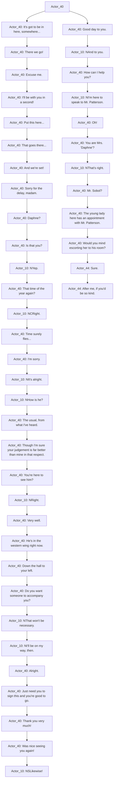

# Ionia/Wenger Sanatorium/Reception

```mermaid
graph TD
    492_0["Actor_40"]
    492_1["Actor_40: It's got to be in here, somewhere..."]
    492_2["Actor_40: There we go!"]
    492_3["Actor_40: Excuse me."]
    492_4["Actor_40: I'll be with you in a second!"]
    492_5["Actor_40: Put this here..."]
    492_6["Actor_40: That goes there..."]
    492_7["Actor_40: And we're set!"]
    492_8["Actor_40: Sorry for the delay, madam."]
    492_9["Actor_40: Daphne?"]
    492_10["Actor_40: Is that you?"]
    492_11["Actor_10: NYep."]
    492_12["Actor_40: That time of the year again?"]
    492_13["Actor_10: NCRight."]
    492_14["Actor_40: Time surely flies..."]
    492_15["Actor_40: I'm sorry."]
    492_16["Actor_10: NIt's alright."]
    492_17["Actor_10: NHow is he?"]
    492_18["Actor_40: The usual, from what I've heard."]
    492_19["Actor_40: Though I'm sure your judgement is far better than mine in that respect."]
    492_20["Actor_40: You're here to see him?"]
    492_21["Actor_10: NRight."]
    492_22["Actor_40: Very well."]
    492_23["Actor_40: He's in the western wing right now."]
    492_24["Actor_40: Down the hall to your left."]
    492_25["Actor_40: Do you want someone to accompany you?"]
    492_26["Actor_10: NThat won't be necessary."]
    492_27["Actor_10: NI'll be on my way, then."]
    492_28["Actor_40: Alright."]
    492_29["Actor_40: Just need you to sign this and you're good to go."]
    492_30["Actor_40: Thank you very much!"]
    492_31["Actor_40: Was nice seeing you again!"]
    492_32["Actor_10: NSLikewise!"]
    492_33["Actor_40: Good day to you."]
    492_34["Actor_10: NAnd to you."]
    492_35["Actor_40: How can I help you?"]
    492_36["Actor_10: NI'm here to speak to Mr. Patterson."]
    492_37["Actor_40: Oh!"]
    492_38["Actor_40: You are Mrs. 'Daphne'?"]
    492_39["Actor_10: NThat's right."]
    492_40["Actor_40: Mr. Sobol?"]
    492_41["Actor_40: The young lady here has an appointment with Mr. Patterson."]
    492_42["Actor_40: Would you mind escorting her to his room?"]
    492_43["Actor_44: Sure."]
    492_44["Actor_44: After me, if you'd be so kind."]
    492_0 --> 492_1
    492_0 --> 492_33
    492_1 --> 492_2
    492_2 --> 492_3
    492_3 --> 492_4
    492_4 --> 492_5
    492_5 --> 492_6
    492_6 --> 492_7
    492_7 --> 492_8
    492_8 --> 492_9
    492_9 --> 492_10
    492_10 --> 492_11
    492_11 --> 492_12
    492_12 --> 492_13
    492_13 --> 492_14
    492_14 --> 492_15
    492_15 --> 492_16
    492_16 --> 492_17
    492_17 --> 492_18
    492_18 --> 492_19
    492_19 --> 492_20
    492_20 --> 492_21
    492_21 --> 492_22
    492_22 --> 492_23
    492_23 --> 492_24
    492_24 --> 492_25
    492_25 --> 492_26
    492_26 --> 492_27
    492_27 --> 492_28
    492_28 --> 492_29
    492_29 --> 492_30
    492_30 --> 492_31
    492_31 --> 492_32
    492_33 --> 492_34
    492_34 --> 492_35
    492_35 --> 492_36
    492_36 --> 492_37
    492_37 --> 492_38
    492_38 --> 492_39
    492_39 --> 492_40
    492_40 --> 492_41
    492_41 --> 492_42
    492_42 --> 492_43
    492_43 --> 492_44
```